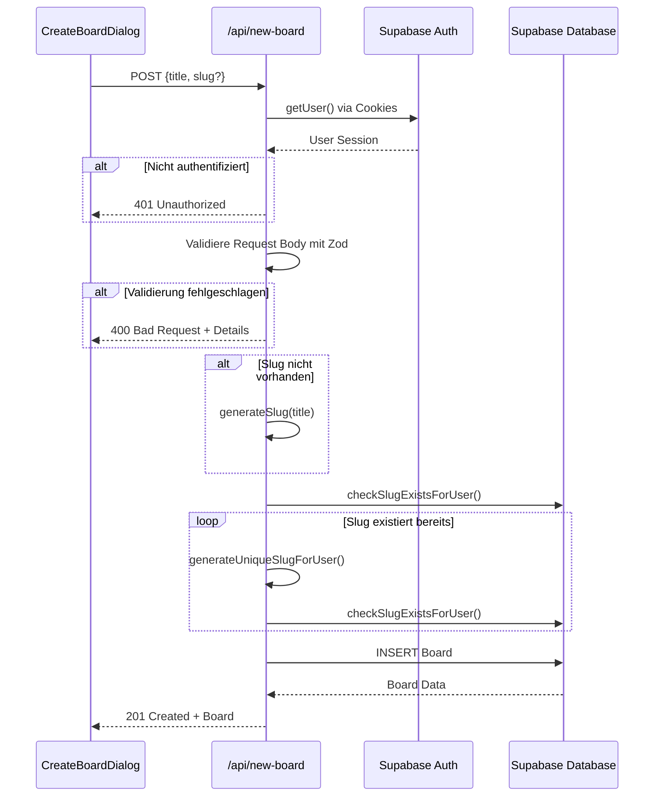

# API-Route `/app/api/new-board/route.ts` - Implementierungsplan

## Übersicht

Diese API-Route ersetzt die bestehende Client-seitige Board-Erstellung durch eine serverseitige Implementierung. Dies bietet verbesserte Sicherheit durch serverseitige Authentifizierung und Validierung.

## Architektur



## Implementierungsdetails

### 1. API-Route Struktur

**Datei:** [`app/api/new-board/route.ts`](app/api/new-board/route.ts)

```typescript
import { NextRequest, NextResponse } from "next/server";
import { createClient } from "@/lib/supabase/server";
import { z } from "zod";
import type { Board, BoardData, GridConfig, Block } from "@/lib/types/board";

// Zod Schema für Request-Validierung
const gridConfigSchema = z.object({
  columns: z.number().int().min(1).max(4),
  gap: z.number().int().min(0),
});

const blockSchema = z.object({
  id: z.string(),
  type: z.enum([
    "text",
    "heading",
    "image",
    "button",
    "spacer",
    "video",
    "form",
    "pricing",
    "testimonial",
    "accordion",
    "code",
  ]),
  data: z.record(z.string(), z.unknown()),
  position: z
    .object({
      x: z.number(),
      y: z.number(),
    })
    .optional(),
  size: z
    .object({
      width: z.number(),
      height: z.number(),
    })
    .optional(),
});

const createBoardRequestSchema = z.object({
  title: z
    .string()
    .min(3, "Title must be at least 3 characters")
    .max(100, "Title must be at most 100 characters"),
  slug: z
    .string()
    .min(3)
    .max(50)
    .regex(
      /^[a-z0-9-]+$/,
      "Slug may only contain lowercase letters, numbers, and hyphens"
    )
    .optional(),
  grid_config: gridConfigSchema.optional(),
  blocks: z.array(blockSchema).optional(),
  template_id: z.string().uuid().optional(),
  is_template: z.boolean().optional(),
});

export async function POST(request: NextRequest) {
  // 1. Authentifizierung prüfen
  // 2. Request-Body validieren
  // 3. Slug generieren/validieren
  // 4. Board erstellen
  // 5. Response zurückgeben
}
```

### 2. Authentifizierung

Verwendet den Server-Side Supabase Client aus [`lib/supabase/server.ts`](lib/supabase/server.ts:26):

```typescript
const supabase = await createClient();
const {
  data: { user },
  error: authError,
} = await supabase.auth.getUser();

if (authError || !user) {
  return NextResponse.json({ error: "Nicht authentifiziert" }, { status: 401 });
}
```

### 3. Validierung

Verwendet Zod-Schemas konsistent mit [`app/lib/services/board-service.ts`](app/lib/services/board-service.ts:19-54):

```typescript
const body = await request.json();
const validationResult = createBoardRequestSchema.safeParse(body);

if (!validationResult.success) {
  return NextResponse.json(
    {
      error: "Ungültige Eingabedaten",
      details: validationResult.error.flatten().fieldErrors,
    },
    { status: 400 }
  );
}
```

### 4. Slug-Generierung

Wiederverwendet Logik aus [`board-service.ts`](app/lib/services/board-service.ts:105-135):

```typescript
// Helper-Funktionen (in route.ts oder separatem Modul)
function generateSlug(title: string): string {
  return title
    .toLowerCase()
    .trim()
    .replace(/[^a-z0-9]+/g, "-")
    .replace(/^-+|-+$/g, "")
    .slice(0, 50);
}

async function generateUniqueSlugForUser(
  supabase: SupabaseClient,
  userId: string,
  baseSlug: string
): Promise<string> {
  let slug = baseSlug;
  let counter = 1;

  while (await checkSlugExists(supabase, userId, slug)) {
    slug = `${baseSlug.slice(0, 45)}-${counter}`;
    counter++;
  }

  return slug;
}
```

### 5. Board-Erstellung

```typescript
const boardData: BoardData = {
  user_id: user.id,
  title: validatedData.title,
  slug: finalSlug,
  grid_config: validatedData.grid_config || { columns: 4, gap: 16 },
  blocks: validatedData.blocks || [],
  template_id: validatedData.template_id,
  is_template: validatedData.is_template,
};

const { data: board, error: insertError } = await supabase
  .from("boards")
  .insert(boardData)
  .select()
  .single();

if (insertError) {
  return NextResponse.json(
    { error: "Fehler beim Erstellen des Boards" },
    { status: 500 }
  );
}

return NextResponse.json(board, { status: 201 });
```

### 6. HTTP-Statuscodes

| Status | Verwendung                                                             |
| ------ | ---------------------------------------------------------------------- |
| 201    | Board erfolgreich erstellt                                             |
| 400    | Ungültige Eingabedaten (Validierungsfehler)                            |
| 401    | Nicht authentifiziert                                                  |
| 409    | Slug-Konflikt (optional, wenn unique slug nicht generiert werden kann) |
| 500    | Server-/Datenbankfehler                                                |

## Anpassungen an Client-Code

### 1. Neuer API-Service

**Datei:** `app/lib/services/api-board-service.ts` (neu)

```typescript
interface CreateBoardAPIRequest {
  title: string;
  slug?: string;
  grid_config?: GridConfig;
  blocks?: Block[];
  template_id?: string;
  is_template?: boolean;
}

export async function createBoardViaAPI(
  data: CreateBoardAPIRequest
): Promise<Board> {
  const response = await fetch("/api/new-board", {
    method: "POST",
    headers: { "Content-Type": "application/json" },
    body: JSON.stringify(data),
  });

  if (!response.ok) {
    const error = await response.json();
    throw new Error(error.message || "Fehler beim Erstellen des Boards");
  }

  return response.json();
}
```

### 2. Hook-Anpassung

**Datei:** [`app/lib/hooks/use-boards.ts`](app/lib/hooks/use-boards.ts:44-59)

```typescript
export function useCreateBoard() {
  const queryClient = useQueryClient();

  return useMutation<Board, Error, CreateBoardAPIRequest>({
    mutationFn: (data) => createBoardViaAPI(data),
    onSuccess: (newBoard) => {
      queryClient.invalidateQueries({ queryKey: ["boards"] });
      queryClient.invalidateQueries({ queryKey: ["recent-boards"] });
      toast.success(`Board "${newBoard.title}" erstellt`);
    },
    onError: (error) => {
      console.error("Fehler beim Erstellen des Boards:", error);
      toast.error("Fehler beim Erstellen des Boards");
    },
  });
}
```

### 3. Dialog-Anpassung

**Datei:** [`app/[locale]/builder/components/CreateBoardDialog.tsx`](app/[locale]/builder/components/CreateBoardDialog.tsx:229-246)

Die `onSubmit` Funktion wird vereinfacht:

```typescript
const onSubmit = async (data: CreateBoardFormData) => {
  try {
    const newBoard = await createBoardMutation.mutateAsync({
      title: data.title,
      slug: data.slug, // Optional - Server generiert wenn nicht vorhanden
    });

    setCurrentBoard(newBoard);
    onOpenChange(false);
    toast.success(t("success"));
  } catch (error) {
    console.error("Fehler beim Erstellen des Boards:", error);
    toast.error(t("error.createFailed"));
  }
};
```

## Sicherheitsaspekte

1. **Server-Side Authentication**: User-Session wird server-seitig über Cookies validiert
2. **RLS Policies**: Supabase Row-Level Security wird automatisch angewendet
3. **Input Validation**: Zod-Schema validiert alle Eingaben
4. **Slug Sanitization**: Nur erlaubte Zeichen in Slugs
5. **CSRF Protection**: Next.js bietet eingebauten CSRF-Schutz

## Vorteile der neuen Architektur

1. **Sicherheit**: Keine direkte Client-zu-DB Kommunikation
2. **Konsistenz**: Server-seitige Validierung garantiert Datenintegrität
3. **Erweiterbarkeit**: Einfaches Hinzufügen von Middleware (Rate Limiting, Logging)
4. **SEO**: Server-Side Rendering möglich
5. **Type Safety**: Durchgängige TypeScript-Typisierung

## Migrationsschritte

1. ✅ API-Route implementieren
2. ✅ API-Service erstellen
3. ✅ `useCreateBoard` Hook anpassen
4. ✅ `CreateBoardDialog` vereinfachen
5. ✅ Tests schreiben
6. ⚠️ Alte Client-Side Logik als Fallback behalten (optional)

## Risiken und Mitigationen

| Risiko            | Mitigation                                      |
| ----------------- | ----------------------------------------------- |
| API-Downtime      | Fallback auf Client-Side möglich                |
| Increased Latency | Server-Side ist schneller da keine RLS-Overhead |
| Breaking Changes  | Schrittweise Migration mit Feature-Flag         |

## Nächste Schritte

1. Implementierung der API-Route in Code-Mode
2. Unit-Tests für Validierung und Slug-Generierung
3. Integration-Tests für gesamten Flow
4. Performance-Vergleich mit bisheriger Lösung
