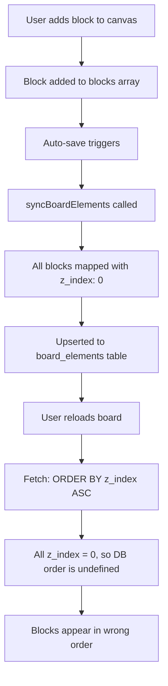

# Block Ordering Issue Analysis

## Problem Statement

Root-level blocks (text, media blocks) are sometimes appearing in the wrong order when boards are reloaded. The last block added may appear in a different position than expected.

## Root Cause Analysis

After thorough investigation of the codebase, I've identified **the critical issue**:

### The Problem: Hardcoded `z_index = 0`

In both [`app/api/boards/[id]/route.ts`](app/api/boards/[id]/route.ts:682) and [`lib/services/board-service.ts`](lib/services/board-service.ts:482), when blocks are saved to the `board_elements` table, **all blocks are assigned `z_index: 0`**:

```typescript
// app/api/boards/[id]/route.ts:673-687
const elementsToUpsert = blocks.map((block) => ({
  id: block.id,
  board_id: boardId,
  type: block.type,
  content: block.data || {},
  position_x: block.position?.x || 0,
  position_y: block.position?.y || 0,
  width: block.size?.width || 100,
  height: block.size?.height || 100,
  z_index: 0, // ❌ PROBLEM: All blocks get the same z_index
  styles: {},
  parent_id: block.parentId || null,
  container_id: block.containerId || null,
  updated_at: new Date().toISOString(),
}));
```

### The Impact

1. **On Save**: All blocks are saved with `z_index: 0`
2. **On Retrieve**: Blocks are fetched `ORDER BY z_index ASC` (see [`app/api/boards/[id]/route.ts:322`](app/api/boards/[id]/route.ts:322))
3. **Result**: When all blocks have the same `z_index`, the database returns them in an **undefined order** (likely by insertion time or primary key), which may not match the array order from the frontend

### Why This Affects Root-Level Blocks

- Grid blocks use `parentId` and `containerId` for ordering within columns
- Root-level blocks rely **solely on array position** in the frontend
- Since `z_index` doesn't preserve array position, root blocks get shuffled on reload

## Data Flow



## Evidence from Code

### Save Operations

1. **[`app/api/boards/[id]/route.ts:673-687`](app/api/boards/[id]/route.ts:673-687)** - PUT/PATCH handler
2. **[`lib/services/board-service.ts:473-485`](lib/services/board-service.ts:473-485)** - Service layer

Both set `z_index: 0` for all blocks.

### Retrieval Operations

**[`app/api/boards/[id]/route.ts:317-322`](app/api/boards/[id]/route.ts:317-322)**:

```typescript
const [elements, connections] = await Promise.all([
  supabase
    .from("board_elements")
    .select("*")
    .eq("board_id", board.id)
    .order("z_index", { ascending: true }), // Orders by z_index
  // ...
]);
```

When all `z_index` values are 0, ordering becomes non-deterministic.

### Canvas Rendering

**[`app/[locale]/builder/components/Canvas.tsx:70`](app/[locale]/builder/components/Canvas.tsx:70)**:

```typescript
{
  rootBlocks.map((block) => {
    // Renders blocks in array order
  });
}
```

Canvas assumes blocks array is in the correct order, but this isn't guaranteed after DB retrieval.

## Solution Design

### Option 1: Use Array Index as z_index (Recommended)

**Pros:**

- Simple, deterministic
- Preserves exact array order
- Minimal code changes

**Cons:**

- Requires recalculating z_index on every block reorder
- Need to handle gaps in z_index when blocks are deleted

**Implementation:**

```typescript
const elementsToUpsert = blocks.map((block, index) => ({
  // ... other fields
  z_index: index, // Use array position as z_index
  // ... other fields
}));
```

### Option 2: Add `order_index` Column

**Pros:**

- Separates visual layering (z_index) from logical ordering (order_index)
- More scalable for future features (e.g., manual z-index control)

**Cons:**

- Requires database migration
- More complex implementation

### Option 3: Use created_at with Microseconds

**Pros:**

- No code changes to save logic
- Works with existing schema

**Cons:**

- Fragile - depends on insertion timing
- Won't handle manual reordering
- Risk of race conditions

## Recommended Solution

**Option 1** is recommended because:

1. It's the simplest fix for the immediate problem
2. It preserves the exact user intent (array order = display order)
3. It requires minimal changes to existing code
4. It's deterministic and testable

## Implementation Plan

### Phase 1: Fix Save Logic

1. Update [`app/api/boards/[id]/route.ts`](app/api/boards/[id]/route.ts:682) syncBoardElements function
2. Update [`lib/services/board-service.ts`](lib/services/board-service.ts:482) syncBoardElements function
3. Change `z_index: 0` to `z_index: index`

### Phase 2: Verify Retrieval Logic

1. Confirm [`app/api/boards/[id]/route.ts:322`](app/api/boards/[id]/route.ts:322) ORDER BY z_index is correct
2. Add fallback ordering (e.g., `ORDER BY z_index ASC, created_at ASC`)

### Phase 3: Handle Edge Cases

1. Test block deletion (ensure z_index gaps don't cause issues)
2. Test block reordering (if implemented in future)
3. Test blocks within grid columns (ensure containerId logic isn't affected)

### Phase 4: Add Tests

1. Unit tests for syncBoardElements
2. Integration tests for save/load cycle
3. E2E tests for block ordering preservation

## Testing Strategy

### Manual Testing

1. Create a board with 5 root-level text blocks in sequence
2. Save the board
3. Reload the page
4. Verify blocks appear in the same order

### Automated Testing

```typescript
describe("Block Ordering", () => {
  it("should preserve root-level block order after save/reload", async () => {
    // 1. Create blocks in specific order
    const blocks = [
      { id: "1", type: "text", data: { text: "First" } },
      { id: "2", type: "text", data: { text: "Second" } },
      { id: "3", type: "text", data: { text: "Third" } },
    ];

    // 2. Save to database
    await syncBoardElements(supabase, boardId, blocks);

    // 3. Retrieve from database
    const { data } = await supabase
      .from("board_elements")
      .select("*")
      .eq("board_id", boardId)
      .order("z_index", { ascending: true });

    // 4. Verify order is preserved
    expect(data[0].id).toBe("1");
    expect(data[1].id).toBe("2");
    expect(data[2].id).toBe("3");
  });
});
```

## Migration Considerations

### Existing Boards

All existing boards have `z_index: 0` for all blocks. When the fix is deployed:

1. **First save** after deployment will assign correct z_index values
2. No data migration needed - the fix is self-correcting on next save
3. Users might see one instance of wrong order before their first edit

### Alternative: Data Migration Script

If immediate fix is required for all boards:

```sql
-- Update z_index based on created_at for existing boards
WITH ordered_blocks AS (
  SELECT
    id,
    board_id,
    ROW_NUMBER() OVER (PARTITION BY board_id ORDER BY created_at ASC) - 1 AS new_z_index
  FROM board_elements
  WHERE parent_id IS NULL  -- Only root-level blocks
)
UPDATE board_elements
SET z_index = ordered_blocks.new_z_index
FROM ordered_blocks
WHERE board_elements.id = ordered_blocks.id;
```

## Related Issues

This fix should also resolve:

- Inconsistent block order across browser refreshes
- Blocks appearing in different order on different devices
- Block order changing after auto-save

## Files to Modify

1. [`app/api/boards/[id]/route.ts`](app/api/boards/[id]/route.ts:682) - Line 682
2. [`lib/services/board-service.ts`](lib/services/board-service.ts:482) - Line 482
3. [`app/api/new-board/route.ts`](app/api/new-board/route.ts) - If it has similar logic

## Success Criteria

- [ ] Root-level blocks maintain order after save/reload
- [ ] Grid column blocks maintain order (no regression)
- [ ] Block deletion doesn't break ordering
- [ ] Auto-save preserves order
- [ ] Manual save preserves order
- [ ] All existing tests pass
- [ ] New tests added and passing
