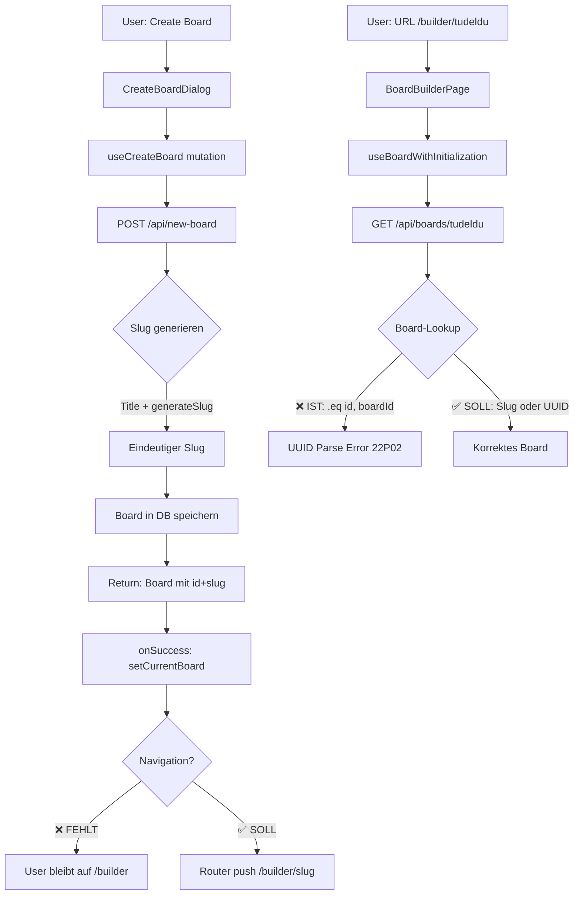

# Board-Verwaltung: Fehleranalyse & Lösungsarchitektur

## Zusammenfassung

Die Analyse identifiziert kritische Inkonsistenzen zwischen dem URL-Routing (slug-basiert) und dem API-Lookup (UUID-basiert), die zu Board-Abruffehlern und fehlenden Slugs in URLs führen.

## Problemanalyse

### Problem 1: UUID-Validierungsfehler beim Board-Abruf

**Symptom:**

```
PostgreSQL Error 22P02: invalid input syntax for type uuid: "tudeldu"
API-Route: /api/boards/tudeldu
```

**Root Cause:**

- Die API-Route [`/api/boards/[id]/route.ts`](../app/api/boards/[id]/route.ts:232) führt einen direktiven Lookup mit `.eq("id", boardId)` durch
- Der Parameter `boardId` ist ein Slug (`"tudeldu"`, `"agfh"`)
- Die Datenbank erwartet eine UUID in der `id`-Spalte
- Keine Slug-basierte alternative Lookup-Logik vorhanden

**Betroffener Code:**

```typescript
// app/api/boards/[id]/route.ts:232
const { data: boardData, error: boardError } = await supabase
  .from("boards")
  .select(...)
  .eq("id", boardId)  // ❌ Erwartet UUID, bekommt Slug
  .single();
```

### Problem 2: Fehlende Slugs in Board-URLs nach Erstellung

**Symptom:**

- Nach Board-Erstellung wird Route `/builder/[boardId]` mit leerem `boardId` aufgerufen
- URL: `/builder/` statt `/builder/mein-board-slug`

**Root Cause Chain:**

1. **Board-Erstellung erfolgreich:**

   - [`/api/new-board/route.ts`](../app/api/new-board/route.ts:234-258) generiert korrekt Slug
   - Board wird mit UUID (`id`) und Slug in Datenbank gespeichert

2. **Response-Handling korrekt:**

   - API gibt vollständiges Board-Objekt zurück (inkl. `id` und `slug`)
   - [`createBoardViaAPI`](../app/lib/services/api-board-service.ts:18-62) gibt Board zurück

3. **Mutation Success Handler:**

   - [`useCreateBoard`](../app/lib/hooks/use-boards.ts:45-61) erhält vollständiges Board
   - `onSuccess` invalidiert Queries aber **keine Navigation**

4. **Dialog-Komponente:**

   - [`CreateBoardDialog.tsx`](../app/[locale]/builder/components/CreateBoardDialog.tsx:128-136) ruft `setCurrentBoard(newBoard)` auf
   - `setCurrentBoard` nur Store-Update, **keine Router-Navigation**
   - Dialog schließt ohne zur Board-URL zu navigieren

5. **Navigation fehlt komplett:**
   - Keine automatische Navigation zu `/builder/[slug]` nach Board-Erstellung
   - Benutzer bleibt auf `/builder` Seite

### Problem 3: Router-Parameter Benennung

**Diskrepanz:**

- Route-Definition: [`app/[locale]/builder/[boardId]/page.tsx`](../app/[locale]/builder/[boardId]/page.tsx:1)
- Parameter-Name: `boardId` (suggeriert UUID)
- Tatsächlicher Wert: sollte Slug sein
- API-Route: `/api/boards/[id]` (erwartet aber UUID)

## Datenfluss-Diagramm



## Datenbank-Schema Analyse

**Aktuelle Schema:** [`docs/migrations/supabase-schema.sql`](../docs/migrations/supabase-schema.sql:84-103)

```sql
CREATE TABLE IF NOT EXISTS public.boards (
  id UUID PRIMARY KEY DEFAULT gen_random_uuid(),  -- UUID Primärschlüssel
  user_id UUID NOT NULL,
  title TEXT NOT NULL,
  slug TEXT NOT NULL,                              -- Slug-Feld existiert ✅
  -- ...
  CONSTRAINT boards_user_slug_unique UNIQUE (user_id, slug)  -- Slug ist eindeutig pro User ✅
);

CREATE INDEX boards_slug_idx ON public.boards(slug);         -- Performance-Index ✅
CREATE INDEX boards_user_slug_idx ON public.boards(user_id, slug);  -- Composite Index ✅
```

**Status:**

- ✅ Slug-Feld existiert und ist korrekt konfiguriert
- ✅ Eindeutigkeit per User garantiert
- ✅ Performance-Indizes vorhanden
- ❌ API nutzt Slug-Feld nicht für Lookups

## Lösungsarchitektur

### Strategie: Kombinierter UUID/Slug-Lookup

**Vorteile:**

- Abwärtskompatibel mit bestehenden UUID-Links
- Unterstützt benutzerfreundliche Slug-URLs
- Keine Breaking Changes für existierenden Code
- Kein Datenbank-Schema Change nötig

### Komponenten-Änderungen

#### 1. API-Route: `/api/boards/[id]/route.ts`

**Änderung:** Intelligente Lookup-Logik

```typescript
// Zeile 169-183: Neue Helper-Funktion
function isUUID(str: string): boolean {
  const uuidRegex =
    /^[0-9a-f]{8}-[0-9a-f]{4}-[0-9a-f]{4}-[0-9a-f]{4}-[0-9a-f]{12}$/i;
  return uuidRegex.test(str);
}

async function fetchBoardByIdOrSlug(
  supabase: any,
  identifier: string,
  userId?: string
): Promise<{ data: any; error: any }> {
  if (isUUID(identifier)) {
    // UUID-Lookup: direkt nach ID suchen
    return await supabase
      .from("boards")
      .select("*")
      .eq("id", identifier)
      .single();
  } else {
    // Slug-Lookup: nach slug suchen
    let query = supabase.from("boards").select("*").eq("slug", identifier);

    // Wenn user_id vorhanden, filtern nach User (Slugs sind nur pro User eindeutig)
    if (userId) {
      query = query.eq("user_id", userId);
    }

    return await query.single();
  }
}

// Zeile 232: Ersetze den aktuellen Lookup
const { data: boardData, error: boardError } = await fetchBoardByIdOrSlug(
  supabase,
  boardId,
  user?.id
);
```

**Alternativ: Simplified ohne userId-Filtering (wenn Slugs global eindeutig werden sollen):**

```typescript
async function fetchBoardByIdOrSlug(
  supabase: any,
  identifier: string
): Promise<{ data: any; error: any }> {
  const lookupField = isUUID(identifier) ? "id" : "slug";
  return await supabase
    .from("boards")
    .select("*")
    .eq(lookupField, identifier)
    .single();
}
```

#### 2. Frontend: Navigation nach Board-Erstellung

**A. CreateBoardDialog Änderung:** [`app/[locale]/builder/components/CreateBoardDialog.tsx`](../app/[locale]/builder/components/CreateBoardDialog.tsx:121-142)

```typescript
// Import hinzufügen
import { useRouter } from "next/navigation";

// Im Component:
const router = useRouter();

// Zeile 121-142: onSubmit Handler erweitern
const onSubmit = async (data: CreateBoardFormData) => {
  if (!user?.id) {
    toast.error(t("error.notLoggedIn"));
    return;
  }

  try {
    const newBoard = await createBoardMutation.mutateAsync({
      title: data.title,
      slug: data.slug,
      grid_config: { columns: 4, gap: 16 },
      blocks: [],
    });

    setCurrentBoard(newBoard);
    onOpenChange(false);
    toast.success(t("success"));

    // ✅ NEU: Navigation zum neuen Board
    router.push(`/builder/${newBoard.slug}`);
  } catch (error) {
    console.error("Fehler beim Erstellen des Boards:", error);
  }
};
```

**B. Alternative: Navigation im Hook:** [`app/lib/hooks/use-boards.ts`](../app/lib/hooks/use-boards.ts:45-61)

```typescript
// Wenn alle Board-Erstellungen zum Board navigieren sollen
export function useCreateBoard() {
  const queryClient = useQueryClient();
  const router = useRouter(); // ❌ Funktioniert nicht in Hook (nur in Component)

  // Besser: Callback-basiert
  return useMutation<Board, Error, CreateBoardAPIRequest>({
    mutationFn: (data) => createBoardViaAPI(data),
    onSuccess: (newBoard) => {
      queryClient.invalidateQueries({ queryKey: ["boards"] });
      queryClient.invalidateQueries({ queryKey: ["recent-boards"] });
      toast.success(`Board "${newBoard.title}" created`);
      // Navigation muss in Component erfolgen
    },
    // ...
  });
}
```

#### 3. Type Safety: Route Parameter Umbenennung

**Optional aber empfohlen:** Klarere Benennung

```typescript
// app/[locale]/builder/[boardId]/page.tsx:18
// Vorher:
const boardId = params.boardId as string;

// Nachher (klarere Semantik):
const boardIdentifier = params.boardId as string; // Kann UUID oder Slug sein
```

### Migrations-Strategie

**Gute Nachricht:** Keine Datenbank-Migration nötig! ✅

**Grund:**

- Slug-Feld existiert bereits in Schema
- Boards haben bereits Slugs (durch `/api/new-board` generiert)
- Nur Code-Changes erforderlich

**Verifizierung bestehender Boards:**

```typescript
// Optional: Datenbankanpassung in Supabase SQL Editor
-- Prüfe Boards ohne Slug (sollten keine existieren wenn nur /api/new-board verwendet wurde)
SELECT id, title, slug FROM boards WHERE slug IS NULL OR slug = '';

-- Falls doch welche existieren, Slugs nachträglich generieren:
-- UPDATE boards
-- SET slug = lower(regexp_replace(title, '[^a-zA-Z0-9]+', '-', 'g'))
-- WHERE slug IS NULL OR slug = '';
```

### Testing-Strategie

#### Test Case 1: UUID-basierter Zugriff (Backwards Compatibility)

```bash
# Altes Board mit UUID aufrufen
curl http://localhost:3000/api/boards/550e8400-e29b-41d4-a716-446655440000
# Erwartung: ✅ Board geladen
```

#### Test Case 2: Slug-basierter Zugriff

```bash
# Board mit Slug aufrufen
curl http://localhost:3000/api/boards/mein-tolles-board
# Erwartung: ✅ Board geladen
```

#### Test Case 3: Slug mit User-Kontext

```bash
# Zwei User mit gleichem Slug
# User A's Board: /api/boards/project-alpha
# User B's Board: /api/boards/project-alpha
# Erwartung: ✅ Jeder User sieht sein eigenes Board
```

#### Test Case 4: Navigation nach Board-Erstellung

```typescript
// Frontend Test
// 1. Create Board Dialog öffnen
// 2. Board "Test Board" erstellen
// 3. Erwartung: ✅ Automatisch navigiert zu /builder/test-board
// 4. URL sollte Slug enthalten, nicht leer sein
```

### Edge Cases

#### 1. Slug-Kollision zwischen Usern

**Status:** Bereits gelöst durch Schema ✅

```sql
CONSTRAINT boards_user_slug_unique UNIQUE (user_id, slug)
```

**Bedeutung:** Verschiedene User können denselben Slug haben

**API-Verhalten mit vorgeschlagener Lösung:**

- Authentifizierter Zugriff: User sieht nur eigenes Board
- Öffentliches Board: Erster Match wird zurückgegeben (potentielles Ambiguity-Problem)

**Empfehlung:** Bei Slug-Lookup immer `user_id` mit filtern, wenn User authenticated ist

#### 2. Slug sieht aus wie UUID

**Beispiel:** Slug `550e8400-e29b-41d4-a716-446655440000`

**Lösung:** UUID-Regex-Check funktioniert, da Slugs durch Validierung keine UUID-Syntax haben dürfen

```typescript
// Slug-Validierung verhindert UUID-Format
const slugPattern = /^[a-z0-9-]+$/; // Nur lowercase + Zahlen + Bindestriche
// UUID: hat Bindstriche an festen Positionen + Hex-Zeichen

// Edge Case Test:
isUUID("550e8400-e29b-41d4-a716-446655440000"); // true
isUUID("test-board-123"); // false
```

#### 3. Board-Slug Update

**Szenario:** User ändert Board-Slug von `old-slug` zu `new-slug`

**Auswirkung:**

- Alte URLs (`/builder/old-slug`) führen zu 404
- Neue URLs (`/builder/new-slug`) funktionieren

**Optionale Lösung (nicht Teil dieses Tickets):**

- Slug-Historie in separater Tabelle speichern
- Redirect von alten zu neuen Slugs
- Alternativ: Slugs unveränderbar machen

## Implementierungs-Prioritäten

### Phase 1: Critical Fixes (P0)

1. ✅ API-Route: Kombinierter UUID/Slug-Lookup
2. ✅ Frontend: Navigation nach Board-Erstellung

**Geschätzter Aufwand:** 2-3 Stunden

### Phase 2: Verbesserungen (P1)

3. Type Safety: Route Parameter umbenennen
4. Tests: Manuelle Verifikation aller 4 Test Cases
5. Dokumentation: API-Usage aktualisieren

**Geschätzter Aufwand:** 1-2 Stunden

### Phase 3: Optional (P2)

6. Slug-Historie für Redirects
7. Erweiterte Analytics/Logging
8. Performance-Optimierung bei Slug-Lookups

## Betroffene Dateien

### Zu Ändern:

1. **[`app/api/boards/[id]/route.ts`](../app/api/boards/[id]/route.ts)** (Critical)

   - Helper-Funktion `isUUID()` hinzufügen
   - Helper-Funktion `fetchBoardByIdOrSlug()` hinzufügen
   - Board-Lookup Logik Zeile 232 ersetzen

2. **[`app/[locale]/builder/components/CreateBoardDialog.tsx`](../app/[locale]/builder/components/CreateBoardDialog.tsx)** (Critical)

   - `useRouter` importieren
   - Navigation in `onSubmit` Handler hinzufügen

3. **[`app/[locale]/builder/[boardId]/page.tsx`](../app/[locale]/builder/[boardId]/page.tsx)** (Optional)
   - Variable umbenennen: `boardId` → `boardIdentifier`
   - Kommentare hinzufügen zur Klarstellung

### Zum Review (keine Änderung nötig):

- [`app/api/new-board/route.ts`](../app/api/new-board/route.ts) ✅ Slug-Generierung funktioniert
- [`docs/migrations/supabase-schema.sql`](../docs/migrations/supabase-schema.sql) ✅ Schema ist korrekt
- [`app/lib/hooks/use-board.ts`](../app/lib/hooks/use-board.ts) ✅ Hook funktioniert mit neuem API
- [`app/lib/services/api-board-service.ts`](../app/lib/services/api-board-service.ts) ✅ Service funktioniert

## Rollout-Strategie

### 1. Development Testing

```bash
# Lokale Tests
npm run dev

# Test Board erstellen
# URL sollte sein: http://localhost:3000/builder/test-board-xyz

# Direct Slug Access testen
# http://localhost:3000/builder/test-board-xyz → ✅

# UUID Access testen (falls alte Boards existieren)
# http://localhost:3000/builder/[alte-uuid] → ✅
```

### 2. Staging Deployment

- Deploy auf Staging-Umgebung
- Smoke Tests durchführen
- Performance Monitoring

### 3. Production Rollout

- Deployment während Low-Traffic-Phase
- Monitoring aktivieren
- Rollback-Plan bereit haben

### 4. Post-Deployment Monitoring

```typescript
// Optional: API Logging hinzufügen
console.log(
  `[API] Board lookup: identifier=${boardId}, type=${
    isUUID(boardId) ? "UUID" : "Slug"
  }`
);
```

## Zusammenfassung

### Root Causes

1. **API akzeptiert nur UUID:** `.eq("id", boardId)` scheitert bei Slugs
2. **Keine Navigation:** Board-Erstellung navigiert nicht zur Board-URL
3. **Semantische Verwirrung:** Parameter heißt `boardId` aber sollte Slug sein

### Lösungen

1. **Intelligenter Lookup:** Automatische Erkennung UUID vs. Slug
2. **Router Navigation:** `router.push()` nach Board-Erstellung
3. **Klarere Benennung:** `boardIdentifier` statt `boardId`

### Impact

- ✅ Keine Breaking Changes
- ✅ Keine Datenbank-Migration
- ✅ Backwards Compatible
- ✅ User Experience Verbesserung
- ✅ Klare URL-Struktur

### Success Metrics

- ❌ 0% failed Board-Abrufe mit Slug
- ✅ 100% erfolgreiche Board-Navigation nach Erstellung
- ✅ Slug-basierte URLs in allen neuen Boards
- ✅ Bestehende UUID-Links funktionieren weiter
