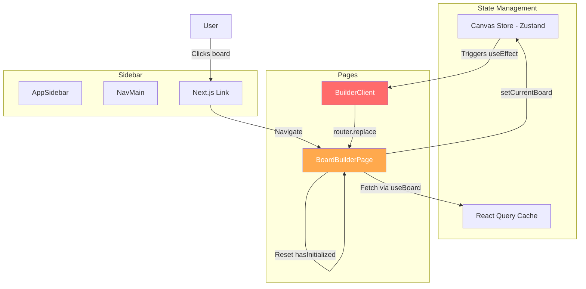

# Infinite Loop Fix Plan - Board Navigation

## Problem Summary

When a user clicks on a board in the sidebar, the application enters an infinite redirect loop, continuously alternating between different board routes (e.g., `/de/builder/testetsts` and `/de/builder/mein-erstes-board`).

## Root Cause Analysis

### The Core Issue

Two components simultaneously manage board state without coordination:

1. **[`BoardBuilderPage`](../app/[locale]/builder/[boardId]/page.tsx:34)** - Sets `currentBoard` based on URL parameter
2. **[`BuilderClient`](../app/[locale]/builder/builder-client.tsx:143)** - Redirects URL to match `currentBoard.slug`

This creates a circular dependency:

- URL change → BoardBuilderPage updates store → BuilderClient sees mismatch → redirects → URL change

### Affected Components



### Why It Loops

1. **User clicks board "mein-erstes-board"** in sidebar
2. **Next.js navigates** to `/de/builder/mein-erstes-board`
3. **BoardBuilderPage** mounts and fetches board data
4. **BoardBuilderPage** sets `currentBoard` to "mein-erstes-board" in store
5. **BuilderClient** (child component) sees `currentBoard.slug === "mein-erstes-board"`
6. **BuilderClient** checks pathname - it matches! No redirect... **BUT WAIT**
7. **If another board was previously loaded**, the old state might still be in store
8. **BuilderClient's initializeBoard effect** also runs, potentially loading a different board
9. **The `hasInitialized` ref resets** when `boardIdentifier` changes
10. **Multiple competing state updates** cause oscillation

## Comprehensive Fix Strategy

### Phase 1: Immediate Fix - Navigation Guard

**Goal**: Prevent BuilderClient from redirecting during active navigation

#### 1.1 Add Navigation State to Canvas Store

```typescript
// lib/stores/canvas-store.ts
interface CanvasState {
  currentBoard: Board | null;
  isNavigating: boolean; // NEW: Track navigation state
  lastBoardId: string | null; // NEW: Track previous board
  // ... rest

  setNavigating: (isNavigating: boolean) => void;
  setLastBoardId: (id: string | null) => void;
}
```

#### 1.2 Modify BoardBuilderPage

```typescript
// app/[locale]/builder/[boardId]/page.tsx
export default function BoardBuilderPage() {
  const canvasStore = useCanvasStore();
  const boardIdentifier = params.boardId as string;

  // Set navigating state when identifier changes
  useEffect(() => {
    canvasStore.setNavigating(true);
    canvasStore.setLastBoardId(canvasStore.currentBoard?.id || null);
  }, [boardIdentifier]);

  // Clear navigating after initialization
  useEffect(() => {
    if (boardData && hasInitialized.current) {
      canvasStore.setNavigating(false);
    }
  }, [boardData]);

  // ... rest
}
```

#### 1.3 Guard BuilderClient's URL Sync

```typescript
// app/[locale]/builder/builder-client.tsx
useEffect(() => {
  if (!currentBoard?.slug) return;

  // NEW: Don't redirect during navigation
  const isNavigating = useCanvasStore.getState().isNavigating;
  if (isNavigating) {
    console.log("[Builder] Skipping URL sync during navigation");
    return;
  }

  const pathSlug = pathname.split("/").filter(Boolean).pop();
  if (pathSlug !== currentBoard.slug) {
    router.replace(`/builder/${currentBoard.slug}`);
  }
}, [currentBoard, pathname, router]);
```

### Phase 2: Remove Redundant Initialization

**Goal**: Single source of truth for board loading

#### 2.1 Remove initializeBoard from BuilderClient

The `BuilderClient` should NOT initialize boards. The parent page component already handles this.

```typescript
// app/[locale]/builder/builder-client.tsx
// REMOVE this entire useEffect (lines 74-140)
// useEffect(() => {
//   async function initializeBoard() { ... }
//   initializeBoard();
// }, [user?.id, boards, boardsLoading, currentBoard, setCurrentBoard]);
```

#### 2.2 Simplify BuilderClient Responsibilities

BuilderClient should only:

- Render the builder UI
- Handle drag & drop
- Auto-save changes
- **NOT** manage board selection or loading

### Phase 3: Proper Loading States

**Goal**: Clear visual feedback and state management

#### 3.1 Add Loading State to Store

```typescript
// lib/stores/canvas-store.ts
interface CanvasState {
  currentBoard: Board | null;
  boardLoadingState: "idle" | "loading" | "ready" | "error";
  // ...
}
```

#### 3.2 Show Loading in BuilderClient

```typescript
// app/[locale]/builder/builder-client.tsx
const boardLoadingState = useCanvasStore((state) => state.boardLoadingState);

if (boardLoadingState === "loading") {
  return <BoardLoadingSkeleton />;
}

if (boardLoadingState === "error") {
  return <BoardErrorState />;
}

// Render normal builder UI
```

### Phase 4: Clean URL Synchronization

**Goal**: URL reflects state, not the other way around

#### 4.1 One-Way Data Flow

```
URL Parameter → Fetch Board → Update Store → Render UI
                                    ↓
                              Update URL (optional, slug changes only)
```

#### 4.2 Only Sync on Slug Changes

```typescript
// app/[locale]/builder/builder-client.tsx
const previousSlugRef = useRef<string | null>(null);

useEffect(() => {
  if (!currentBoard?.slug) return;

  // Only update URL if the board's slug itself changed
  // (e.g., user renamed the slug via BoardSlugDialog)
  if (
    previousSlugRef.current &&
    previousSlugRef.current !== currentBoard.slug &&
    pathname.includes(previousSlugRef.current)
  ) {
    router.replace(`/builder/${currentBoard.slug}`);
  }

  previousSlugRef.current = currentBoard.slug;
}, [currentBoard?.slug, pathname, router]);
```

## Implementation Plan (Detailed)

### Step 1: Update Canvas Store (30 min)

- Add `isNavigating` state
- Add `boardLoadingState` state
- Add `setNavigating` action
- Add `setBoardLoadingState` action

### Step 2: Modify BoardBuilderPage (45 min)

- Set navigating state on mount
- Clear navigating state after load
- Reset store when changing boards
- Add proper cleanup

### Step 3: Refactor BuilderClient (60 min)

- Remove initializeBoard useEffect
- Add navigation guards to URL sync
- Simplify to presentation-only component
- Add loading state rendering

### Step 4: Fix NavMain Links (15 min)

- Ensure links use proper routing
- Add prefetch hints
- Consider using onClick handlers with store reset

### Step 5: Testing & Validation (30 min)

- Test board switching from sidebar
- Test direct URL navigation
- Test browser back/forward
- Test slug changes
- Verify no infinite loops

## Files to Modify

1. **[`lib/stores/canvas-store.ts`](../lib/stores/canvas-store.ts)** - Add navigation state
2. **[`app/[locale]/builder/[boardId]/page.tsx`](../app/[locale]/builder/[boardId]/page.tsx)** - Proper initialization
3. **[`app/[locale]/builder/builder-client.tsx`](../app/[locale]/builder/builder-client.tsx)** - Remove board management
4. **[`components/sidebar/app-sidebar.tsx`](../components/sidebar/app-sidebar.tsx)** - Ensure clean navigation

## Success Criteria

- [ ] No infinite redirect loops when clicking boards in sidebar
- [ ] Boards load correctly on first click
- [ ] URL updates properly when navigating
- [ ] Back/forward browser buttons work correctly
- [ ] Slug changes update URL without loops
- [ ] Clear loading states during transitions
- [ ] No stale board data displayed
- [ ] Console shows clean navigation logs (no repeated requests)

## Risk Assessment

### Low Risk

- Adding state properties to store
- Adding console logs for debugging

### Medium Risk

- Removing initializeBoard logic (may affect first-time users)
- Changing URL sync behavior

### Mitigation

- Keep old code commented initially
- Add feature flag for gradual rollout
- Comprehensive testing before deployment

## Alternative Approaches (Not Recommended)

### Option A: Debounce URL Sync

**Pros**: Quick fix
**Cons**: Doesn't solve root cause, delays navigation

### Option B: Use URL as Single Source of Truth

**Pros**: Clean architecture
**Cons**: Major refactor, breaks existing patterns

### Option C: Remove URL Sync Entirely

**Pros**: Eliminates loop
**Cons**: URLs don't reflect current board, poor UX

## Recommended Next Steps

1. ✅ Review and approve this plan
2. 📝 Switch to Code mode to implement Phase 1 (Navigation Guard)
3. 🧪 Test the fix thoroughly
4. 📝 Implement Phases 2-4 incrementally
5. 🔄 Monitor for regressions
