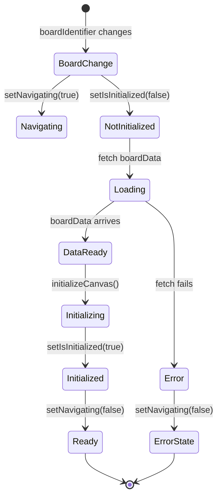

# Navigation State Fix Plan

## Problem Statement

The current implementation in [`app/[locale]/builder/[boardId]/page.tsx`](app/[locale]/builder/[boardId]/page.tsx:75-85) uses a fragile 100ms `setTimeout` to clear the navigating state after initialization completes. This is a race condition workaround that relies on arbitrary timing rather than deterministic completion signals.

## Current Implementation Analysis

### Problematic Code (Lines 75-85)

```typescript
useEffect(() => {
  if (boardData && hasInitialized.current) {
    const timer = setTimeout(() => {
      console.log(
        "[BoardBuilderPage] Navigation complete, clearing navigating state"
      );
      storeActions.setNavigating(false);
    }, 100); // Small delay to ensure state is fully updated

    return () => clearTimeout(timer);
  }
}, [boardData, storeActions]);
```

### Issues

1. **Arbitrary delay**: 100ms timeout has no connection to actual completion
2. **Race conditions**: State updates may not be complete when timeout fires
3. **Unreliable**: Slower systems or heavy loads could exceed 100ms
4. **Non-deterministic**: No concrete signal that initialization is truly complete

## React Best Practices (from Context7)

Based on React documentation patterns:

1. **Avoid `setTimeout` in effects** for state synchronization
2. **Use cleanup flags** (`let cancelled = false`) to prevent state updates after unmount
3. **Derive state during render** when possible, not in effects
4. **Synchronize with concrete signals**, not arbitrary delays

## Proposed Solution

### Option 1: Use `isInitialized` State (RECOMMENDED)

Replace the `hasInitialized` ref with React state to create a deterministic completion signal.

**Benefits:**

- React-idiomatic: State changes trigger predictable re-renders
- Deterministic: Effect runs immediately when state becomes `true`
- No arbitrary delays
- Clear dependency tracking

**Implementation:**

```typescript
const [isInitialized, setIsInitialized] = useState(false);

// Reset on board change
useEffect(() => {
  setIsInitialized(false);
  storeActions.setNavigating(true);
  // ... other setup
}, [boardIdentifier, storeActions]);

// Initialize canvas
useEffect(() => {
  if (boardData && !isInitialized) {
    initializeCanvas({ setCurrentBoard: storeActions.setCurrentBoard });
    setIsInitialized(true);
    storeActions.setBoardLoadingState("ready");
  }
}, [boardData, isInitialized, initializeCanvas, storeActions]);

// Clear navigating immediately when initialized
useEffect(() => {
  if (isInitialized) {
    storeActions.setNavigating(false);
  }
}, [isInitialized, storeActions]);
```

### Option 2: Use `boardLoadingState` from Store

Leverage the existing `boardLoadingState` that's already set to `'ready'` after initialization.

**Benefits:**

- Uses existing state management
- Single source of truth
- No new state needed

**Implementation:**

```typescript
const boardLoadingState = useCanvasStore((state) => state.boardLoadingState);

useEffect(() => {
  if (boardLoadingState === "ready") {
    storeActions.setNavigating(false);
  }
}, [boardLoadingState, storeActions]);
```

### Option 3: Promise-based Initialization

Modify `initializeCanvas` to return a Promise that resolves when complete.

**Benefits:**

- Explicit async completion
- Can handle async initialization logic

**Drawbacks:**

- Requires modifying the hook
- More complex for synchronous operations

## Recommended Approach: Option 1 (isInitialized State)

**Rationale:**

1. **Most React-idiomatic**: Uses standard state management patterns
2. **Clear separation of concerns**: Each effect has a single responsibility
3. **Easy to understand**: State flow is explicit and traceable
4. **No external dependencies**: Doesn't require modifying hooks or store
5. **Handles edge cases**: Error states already clear navigating separately

## Implementation Steps

1. **Import `useState`** from React
2. **Replace `hasInitialized` ref** with `isInitialized` state
3. **Update board change effect** to reset `isInitialized` to `false`
4. **Update initialization effect** to set `isInitialized` to `true`
5. **Replace timeout effect** with immediate state-based effect
6. **Remove timer and cleanup code**
7. **Update dependencies** to include `isInitialized`

## Edge Cases Handled

1. **Board changes**: `isInitialized` resets to `false` when `boardIdentifier` changes
2. **Error states**: Existing error effect already clears navigating
3. **Unmounting**: No cleanup needed since we're not using timers
4. **Multiple rapid changes**: State updates are batched and handled correctly

## Testing Considerations

- Verify navigating state clears immediately after initialization
- Test rapid board switching
- Verify error states still clear navigating
- Check that no console warnings appear
- Ensure no performance regression

## Mermaid Diagram: State Flow



## Conclusion

The `isInitialized` state approach provides a clean, deterministic solution that follows React best practices and eliminates the fragile timeout workaround. It's the most maintainable and reliable option for clearing the navigating state.
