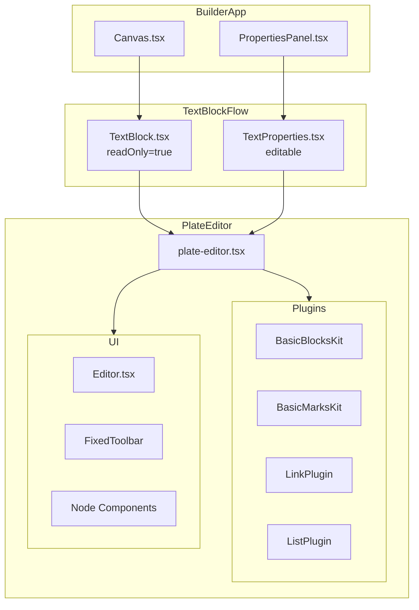

# PlateJS Integration Analysis Report

## Übersicht

Dieses Dokument analysiert die aktuelle PlateJS-Integration im Projekt und vergleicht sie mit der offiziellen Dokumentation und Best Practices.

**PlateJS Version:** 52.0.0 (aktuell)

**Installierte Pakete:**

- `platejs` - Core-Paket
- `@platejs/basic-nodes` - Grundlegende Block-Elemente
- `@platejs/basic-styles` - Schrift-Farben und -Stile
- `@platejs/link` - Link-Unterstützung
- `@platejs/list` - Listen-Unterstützung
- `@udecode/cn` - Utility-Funktionen

---

## Hauptkomponenten

### 1. `components/plate-editor.tsx`

Haupt-Editor-Wrapper-Komponente, die den PlateJS-Editor konfiguriert und rendert.

### 2. `app/[locale]/builder/components/blocks/TextBlock.tsx`

Verwendet PlateEditor für die Anzeige von Text-Blöcken im Builder.

### 3. `app/[locale]/builder/components/properties/TextProperties.tsx`

Properties Panel mit bearbeitbarem PlateEditor.

### 4. `components/editor/plugins/` Verzeichnis

Enthält Plugin-Kits für Blocks und Marks.

---

## Gefundene Probleme

### 🔴 Kritisch: Anti-Pattern `key={JSON.stringify(content)}`

**Datei:** [`TextBlock.tsx`](app/[locale]/builder/components/blocks/TextBlock.tsx:81)

```typescript
<PlateEditor
  key={JSON.stringify(content)} // ❌ Performance-Problem!
  initialValue={content}
  onChange={handleChange}
  readOnly={true}
  className="px-0 py-0 pb-0 min-h-0 sm:px-0"
/>
```

**Problem:**

- Bei jeder Änderung des `content` wird der gesamte Editor zerstört und neu erstellt
- Dies verursacht Performance-Probleme bei großen Dokumenten
- Bricht die interne History/Selection-Logik von Slate/Plate

**PlateJS-Dokumentation sagt:**

> "Implementing a fully controlled editor value in Plate is complex [...] All changes to the editor's value should ideally happen through Transforms to maintain consistency with selection and history."

**Empfehlung:**
Für programmatische Value-Updates `editor.tf.setValue()` verwenden statt den Editor neu zu erstellen.

---

### 🟡 Mittel: Inkonsistente Plugin-Konfiguration

**Datei:** [`basic-blocks-kit.tsx`](components/editor/plugins/basic-blocks-kit.tsx)

Manche Plugins verwenden `.withComponent()`:

```typescript
ParagraphPlugin.withComponent(ParagraphElement),
HorizontalRulePlugin.withComponent(HrElement),
```

Andere verwenden `.configure({ node: { component: ... } })`:

```typescript
H1Plugin.configure({
    node: {
        component: H1Element,
    },
    ...
}),
```

**Empfehlung:**
Konsistenz bei der Konfiguration:

- `.withComponent()` - für einfache Komponenten-Zuweisungen
- `.configure()` - wenn zusätzliche Optionen benötigt werden

---

### 🟡 Mittel: Komplexe ListPlugin Render-Logik

**Datei:** [`plate-editor.tsx`](components/plate-editor.tsx:33-48)

```typescript
ListPlugin.configure({
    render: {
        node: ({ element, ...props }) => {
            if (element.type === 'ul') {
                return <ListElement variant="ul" element={element} {...props} />;
            }
            if (element.type === 'ol') {
                return <ListElement variant="ol" element={element} {...props} />;
            }
            if (element.type === 'li') {
                return <ListItemElement element={element} {...props} />;
            }
            return null;
        },
    },
}),
```

**Problem:**

- Manuelle Typ-Überprüfung in der render-Funktion
- Nicht modular und schwer erweiterbar

**Empfehlung:**
Separate Plugin-Konfigurationen für unterschiedliche Listentypen:

```typescript
import {
    BulletedListPlugin,
    NumberedListPlugin,
    ListItemPlugin
} from '@platejs/list/react';

// Separates Rendering pro Plugin
BulletedListPlugin.withComponent(BulletedListElement),
NumberedListPlugin.withComponent(NumberedListElement),
ListItemPlugin.withComponent(ListItemElement),
```

---

### 🟢 Info: TextBlock ist immer readOnly

**Datei:** [`TextBlock.tsx`](app/[locale]/builder/components/blocks/TextBlock.tsx:84)

```typescript
readOnly={true}  // Immer read-only im TextBlock
```

**Analyse:**
Dies ist ein **valides Pattern** für den Use-Case:

- TextBlock dient nur zur Anzeige auf dem Canvas
- Bearbeitung erfolgt in `TextProperties.tsx` im Properties Panel
- Separates Editing-Fenster vermeidet Konflikte mit Drag & Drop

---

### 🟢 Info: Fehlende Plugins

Folgende Plugins könnten nützlich sein:

| Plugin                    | Zweck                    | Priorität |
| ------------------------- | ------------------------ | --------- |
| `HistoryPlugin`           | Undo/Redo                | Hoch      |
| `SelectOnBackspacePlugin` | Bessere Block-Navigation | Mittel    |
| `ExitBreakPlugin`         | Bessere Enter-Logik      | Mittel    |
| `SoftBreakPlugin`         | Shift+Enter Support      | Niedrig   |
| `AutoformatPlugin`        | Markdown-Shortcuts       | Niedrig   |

---

## Positive Aspekte ✅

1. **Korrekte Import-Struktur:** Verwendung von `platejs/react` und `@platejs/*` Paketen
2. **Plugin-Kits:** Gute Modularisierung in `BasicBlocksKit` und `BasicMarksKit`
3. **Custom UI-Komponenten:** Gut strukturierte Plate-UI-Komponenten
4. **Toolbar-Implementation:** Korrekte Verwendung von `useMarkToolbarButton` und Hooks
5. **Aktuelle Version:** PlateJS 52.0.0 ist auf dem neuesten Stand
6. **TypeScript:** Gute Typisierung

---

## Empfohlene Verbesserungen

### Priorität 1: `key={JSON.stringify()}` Anti-Pattern entfernen

**Vorschlag A - Uncontrolled Pattern (empfohlen für diesen Use-Case):**

Da TextBlock nur zum Anzeigen dient und readOnly ist, kann der Key komplett entfernt werden:

```typescript
// TextBlock.tsx - ReadOnly Display
<PlateEditor
  initialValue={content} // Nur initialer Wert
  readOnly={true}
  className="px-0 py-0 pb-0 min-h-0 sm:px-0"
/>
```

Für dynamische Content-Updates kann ein `useEffect` mit `editor.tf.setValue()` verwendet werden:

```typescript
// Option: Wenn Content extern geändert wird
const editor = usePlateEditor({
  /* ... */
});

useEffect(() => {
  if (contentChanged) {
    editor.tf.setValue(newContent);
  }
}, [externalContent]);
```

**Vorschlag B - Block-ID als Key (wenn Neuinitialisierung erwünscht):**

```typescript
<PlateEditor
  key={block.id} // Nur neu initialisieren wenn Block wechselt
  initialValue={content}
  readOnly={true}
/>
```

### Priorität 2: Konsistente Plugin-Konfiguration

```typescript
// Empfohlenes Pattern für basic-blocks-kit.tsx
export const BasicBlocksKit = [
  // Einfache Komponenten → .withComponent()
  ParagraphPlugin.withComponent(ParagraphElement),
  HorizontalRulePlugin.withComponent(HrElement),
  BlockquotePlugin.withComponent(BlockquoteElement),

  // Mit zusätzlichen Optionen → .configure()
  H1Plugin.configure({
    node: { component: H1Element },
    rules: { break: { empty: "reset" } },
    shortcuts: { toggle: { keys: "mod+alt+1" } },
  }),
  // ...
];
```

### Priorität 3: History-Plugin hinzufügen

**STATUS: ANALYSIERT** ⏳

In PlateJS v52 ist das `HistoryPlugin` nicht als separates Export vorhanden. Undo/Redo wird durch Slate's interne History automatisch verwaltet und ist bereits aktiviert.

### Priorität 4: Liste-Plugins modernisieren

```typescript
// Separate Plugins statt einer großen render-Funktion
import {
  BulletedListPlugin,
  NumberedListPlugin,
  ListItemPlugin,
} from "@platejs/list/react";

const plugins = [
  BulletedListPlugin.withComponent(BulletedListElement),
  NumberedListPlugin.withComponent(NumberedListElement),
  ListItemPlugin.withComponent(ListItemElement),
];
```

---

## Status der Implementierung

| Änderung | Status | Datei |\n|----------|--------|-------|\n| `key={JSON.stringify()}` entfernen | ✅ FERTIG | [`TextBlock.tsx`](app/[locale]/builder/components/blocks/TextBlock.tsx) |\n| Plugin-Konfiguration vereinheitlichen | ✅ FERTIG | [`basic-blocks-kit.tsx`](components/editor/plugins/basic-blocks-kit.tsx) |\n| HistoryPlugin-Analyse | ✅ FERTIG | Bereits im Slate enthalten, kein separates Plugin nötig |\n| Dokumentation aktualisiert | ✅ FERTIG | Diese Datei |\n\n---\n\n## Architektur-Diagramm



---

## Zusammenfassung

| Kategorie                | Status           | Aktion erforderlich              |
| ------------------------ | ---------------- | -------------------------------- |
| PlateJS Version          | ✅ Aktuell (v52) | Keine                            |
| Plugin-Struktur          | ✅ Gut           | Konsistenz verbessern            |
| UI-Komponenten           | ✅ Gut           | Keine                            |
| Controlled Value Pattern | ❌ Anti-Pattern  | `key={JSON.stringify}` entfernen |
| History Support          | ⚠️ Fehlt         | HistoryPlugin hinzufügen         |
| Listen-Konfiguration     | ⚠️ Verbesserbar  | Separate Plugins verwenden       |

---

## Nächste Schritte

1. **Sofort:** `key={JSON.stringify(content)}` durch `key={block.id}` ersetzen
2. **Kurzfristig:** HistoryPlugin hinzufügen
3. **Mittelfristig:** Plugin-Konfiguration vereinheitlichen
4. **Optional:** Autoformat-Plugin für Markdown-Shortcuts hinzufügen
