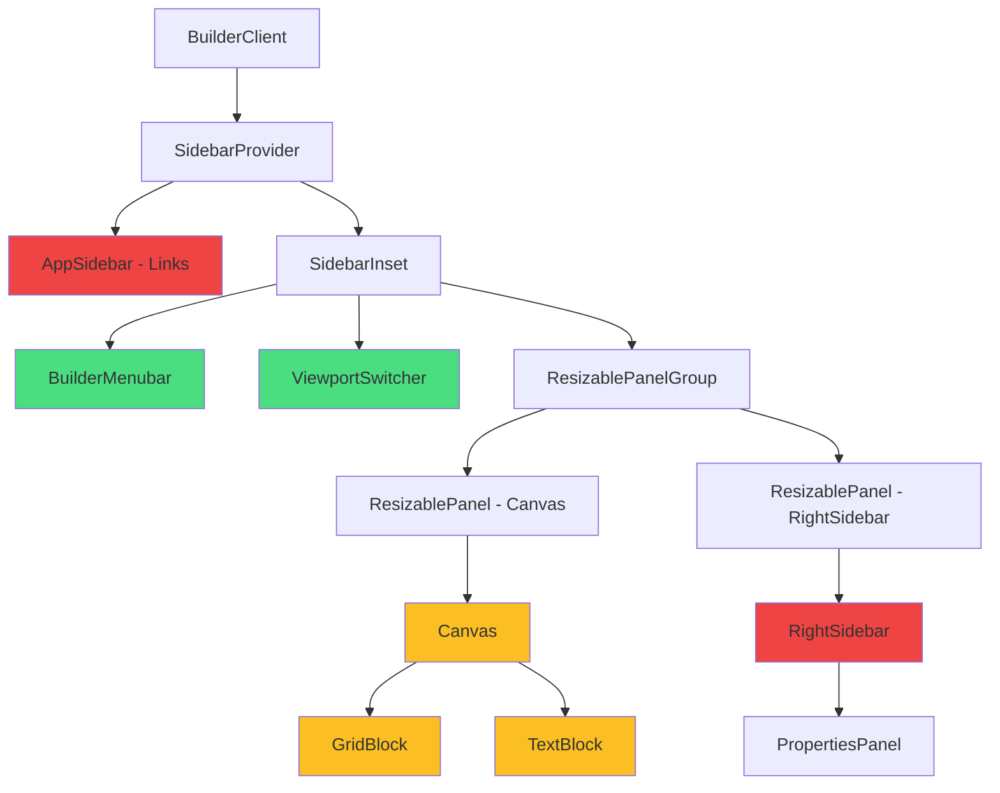

# Preview-Modus Implementierungsplan

## 🎯 Zielsetzung

Implementierung eines vollständigen Preview-Modus im Builder, der zeigt, wie die Blöcke in der finalen öffentlichen Ansicht gerendert werden. Der Preview-Modus soll:

- Alle Editor-UIs ausblenden (Toolbar, Selection, Properties Panel, Delete-Buttons)
- Inline-Editing deaktivieren (Read-Only Modus)
- Nur Menubar und Viewport-Switcher sichtbar lassen
- Einfache Umschaltung zwischen Builder und Preview ermöglichen

## 📊 Aktuelle Architektur

### Komponenten-Hierarchie



**Legende:**

- 🟢 Grün: Bleibt im Preview-Modus sichtbar
- 🟡 Gelb: Muss für Preview-Modus angepasst werden
- 🔴 Rot: Wird im Preview-Modus ausgeblendet

### Bestehender State

**[`lib/stores/canvas-store.ts`](lib/stores/canvas-store.ts)**:

```typescript
interface CanvasState {
  currentBoard: Board | null;
  blocks: Block[];
  selectedBlockIds: string[];
  // ... weitere States
  showGrid: boolean; // Bereits vorhanden
  // TODO: isPreviewMode hinzufügen
}
```

**[`app/[locale]/builder/components/BuilderMenubar.tsx:86`](app/[locale]/builder/components/BuilderMenubar.tsx:86)**:

```typescript
// Aktuell nur lokaler State, keine Auswirkung
const [isPreviewMode, setIsPreviewMode] = React.useState(false);
```

## 🏗️ Implementierungsplan

### Phase 1: State Management

#### 1.1 Canvas Store erweitern

**Datei**: [`lib/stores/canvas-store.ts`](lib/stores/canvas-store.ts)

```typescript
interface CanvasState {
    // ... existing states
    isPreviewMode: boolean; // ← NEU

    // ... existing actions
    setPreviewMode: (enabled: boolean) => void; // ← NEU
}

const initialState = {
    // ... existing
    isPreviewMode: false,
};

// Action implementieren
setPreviewMode: (enabled) => set({ isPreviewMode: enabled }),
```

**Begründung**:

- Zentraler State für alle Komponenten zugänglich
- Zustand bleibt beim Board-Wechsel erhalten (optional)
- Einfache Subscription für reaktive Updates

---

### Phase 2: BuilderMenubar Integration

#### 2.1 BuilderMenubar an Store anbinden

**Datei**: [`app/[locale]/builder/components/BuilderMenubar.tsx`](app/[locale]/builder/components/BuilderMenubar.tsx)

**Änderungen**:

```typescript
// VORHER (Zeile 86):
const [isPreviewMode, setIsPreviewMode] = React.useState(false);

// NACHHER:
const isPreviewMode = useCanvasStore((state) => state.isPreviewMode);
const setPreviewMode = useCanvasStore((state) => state.setPreviewMode);

// handleTogglePreview anpassen (Zeile 212):
const handleTogglePreview = React.useCallback(() => {
  setPreviewMode(!isPreviewMode);
  console.log(`Preview-Modus: ${!isPreviewMode}`);
}, [isPreviewMode, setPreviewMode]);
```

#### 2.2 Tastenkombination hinzufügen

**Datei**: [`app/[locale]/builder/components/BuilderMenubar.tsx`](app/[locale]/builder/components/BuilderMenubar.tsx)

Im `handleKeyDown` useEffect (ca. Zeile 283):

```typescript
// Nach den Ansicht-Menü Shortcuts (Zeile 341+)
else if (modifier && e.key === "p") {
    e.preventDefault();
    handleTogglePreview();
}
```

Shortcut anzeigen:

```typescript
<MenubarRadioItem
  value="preview"
  onClick={() => isPreviewMode || handleTogglePreview()}
>
  <Eye className="mr-2 h-4 w-4" />
  <span>Vorschau-Modus</span>
  <MenubarShortcut>{getShortcut("P")}</MenubarShortcut> {/* NEU */}
</MenubarRadioItem>
```

---

### Phase 3: Canvas-Anpassungen

#### 3.1 Canvas für Preview-Modus anpassen

**Datei**: [`app/[locale]/builder/components/Canvas.tsx`](app/[locale]/builder/components/Canvas.tsx)

```typescript
export default function Canvas({ currentViewport, zoomLevel = 100 }: CanvasProps) {
    const blocks = useCanvasStore((state) => state.blocks);
    const rootBlocks = blocks.filter(b => !b.parentId);
    const selectedBlockIds = useCanvasStore((state) => state.selectedBlockIds);
    const selectBlock = useCanvasStore((state) => state.selectBlock);
    const currentBoard = useCanvasStore((state) => state.currentBoard);
    const showGrid = useCanvasStore((state) => state.showGrid);
    const isPreviewMode = useCanvasStore((state) => state.isPreviewMode); // ← NEU

    // ...

    return (
        <div className="flex flex-1 flex-col gap-4 p-4 pt-0">
            <div className="flex flex-1 items-start justify-center rounded-xl border-2 border-dashed border-muted bg-muted/20 min-h-[600px] p-4 w-full max-w-[1200px] mx-auto">
                <div
                    className={`${getViewportClasses(currentViewport)} ...`}
                    style={{
                        transform: `scale(${zoomScale})`,
                        transformOrigin: "top center",
                        backgroundImage: (showGrid && !isPreviewMode) // ← Grid nur im Builder-Modus
                            ? "linear-gradient(...)"
                            : "none",
                        backgroundSize: "20px 20px",
                    }}
                >
                    <div
                        className="p-6 h-full flex flex-col"
                        onClick={() => !isPreviewMode && selectBlock(null)} // ← Deselection nur im Builder
                    >
                        <div className="flex flex-col gap-4 flex-1">
                            {blocks.length > 0 && (
                                <>
                                    {/* Board-Titel nur im Preview-Modus anzeigen */}
                                    {isPreviewMode && (
                                        <div className="text-center mb-4">
                                            <h2 className="text-2xl font-semibold text-foreground mb-2">
                                                {currentBoard?.title || "Untitled Board"}
                                            </h2>
                                        </div>
                                    )}

                                    {/* Blocks ohne Debug-Info im Preview */}
                                    {!isPreviewMode && (
                                        <div className="text-center mb-4">
                                            <h2 className="text-2xl font-semibold text-muted-foreground mb-2">
                                                {currentBoard?.title || "Untitled Board"}
                                            </h2>
                                            <p className="text-sm text-muted-foreground">
                                                {blocks.length} Block{blocks.length !== 1 ? "s" : ""}{" "}
                                                hinzugefügt
                                            </p>
                                        </div>
                                    )}

                                    <div className="space-y-4">
                                        {rootBlocks.map((block) => {
                                            const isSelected = selectedBlockIds.includes(block.id);
                                            return (
                                                <div
                                                    key={block.id}
                                                    tabIndex={isPreviewMode ? -1 : 0} // ← Kein Focus im Preview
                                                    role={isPreviewMode ? undefined : "button"}
                                                    className={cn(
                                                        isPreviewMode
                                                            ? "" // ← Kein Border/Padding im Preview
                                                            : "p-4 border rounded-lg bg-background relative cursor-pointer transition-all focus:outline-none focus:ring-2 focus:ring-primary focus:ring-offset-2",
                                                        !isPreviewMode && isSelected &&
                                                            "ring-2 ring-primary ring-offset-2 border-primary"
                                                    )}
                                                    onClick={(e) => {
                                                        if (isPreviewMode) return; // ← Keine Selection im Preview
                                                        e.stopPropagation();
                                                        const isModifierKey = e.metaKey || e.ctrlKey;
                                                        selectBlock(block.id, { additive: isModifierKey });
                                                    }}
                                                    // onKeyDown nur im Builder-Modus
                                                >
                                                    {/* Delete-Button nur im Builder */}
                                                    {!isPreviewMode && isSelected && block.type !== "text" && (
                                                        <BlockDeleteButton blockId={block.id} />
                                                    )}

                                                    {/* Block-Rendering mit Preview-Prop */}
                                                    {block.type === "grid" ? (
                                                        <GridBlock
                                                            block={block}
                                                            isSelected={isSelected}
                                                            isPreviewMode={isPreviewMode} // ← NEU
                                                        />
                                                    ) : block.type === "text" ? (
                                                        <TextBlock
                                                            block={block}
                                                            isSelected={isSelected}
                                                            isPreviewMode={isPreviewMode} // ← NEU
                                                        />
                                                    ) : (
                                                        // ... andere Block-Typen
                                                    )}
                                                </div>
                                            );
                                        })}
                                    </div>
                                </>
                            )}
                            {/* DropArea nur im Builder-Modus */}
                            {!isPreviewMode && <DropArea />}
                        </div>
                    </div>
                </div>
            </div>
        </div>
    );
}
```

---

### Phase 4: Block-Komponenten Anpassungen

#### 4.1 TextBlock mit Preview-Modus

**Datei**: [`app/[locale]/builder/components/blocks/TextBlock.tsx`](app/[locale]/builder/components/blocks/TextBlock.tsx)

```typescript
interface TextBlockProps {
  block: Block;
  isSelected?: boolean;
  isPreviewMode?: boolean; // ← NEU
}

export function TextBlock({
  block,
  isSelected,
  isPreviewMode = false,
}: TextBlockProps) {
  const extension = useMemo(() => {
    return defineExtension();
  }, []);

  const editor = useMemo(() => {
    return createEditor({
      extension,
      defaultContent: (block.data.content as any) || undefined,
      editable: !isPreviewMode, // ← Editor nur im Builder-Modus editierbar
    });
  }, [extension, block.data.content, isPreviewMode]);

  return (
    <ProseKit editor={editor}>
      <div
        className={cn(
          "w-full h-full min-h-[50px] flex flex-col overflow-hidden",
          !isPreviewMode && "border rounded-md bg-background", // ← Border nur im Builder
          !isPreviewMode &&
            isSelected &&
            "ring-2 ring-primary ring-offset-2 border-primary"
        )}
      >
        {/* Toolbar nur im Builder-Modus und wenn selektiert */}
        {!isPreviewMode && isSelected && <EditorToolbar blockId={block.id} />}

        <div
          className={cn(
            "prose dark:prose-invert max-w-none flex-1 overflow-y-auto",
            !isPreviewMode && "p-4" // ← Padding nur im Builder
          )}
        >
          <div
            ref={editor.mount}
            className={cn(
              "min-h-[50px] h-full",
              !isPreviewMode && "outline-none" // ← Outline nur im Builder nötig
            )}
          />
        </div>
      </div>
    </ProseKit>
  );
}
```

**Wichtig**: ProseKit `editable` Prop:

- Prüfen ob ProseKit `editable` als Option unterstützt
- Falls nicht: `contentEditable={!isPreviewMode}` auf das mount-div setzen
- Alternative: `editor.setEditable(!isPreviewMode)` nach mount

#### 4.2 GridBlock mit Preview-Modus

**Datei**: [`app/[locale]/builder/components/blocks/GridBlock.tsx`](app/[locale]/builder/components/blocks/GridBlock.tsx)

```typescript
interface GridBlockProps {
    block: Block;
    isSelected?: boolean;
    isPreviewMode?: boolean; // ← NEU
}

function GridColumn({ blockId, columnIndex, isPreviewMode }: GridColumnProps) {
    const { setNodeRef, isOver } = useDroppable({
        id: `${blockId}-col-${columnIndex}`,
        data: { type: "column", blockId, columnIndex },
        disabled: isPreviewMode, // ← Drop deaktivieren im Preview
    });

    // ...

    return (
        <div
            ref={setNodeRef}
            className={cn(
                "h-full rounded-lg min-h-[100px] transition-colors p-2 flex flex-col gap-2 relative",
                !isPreviewMode && "border-2 border-dashed border-muted-foreground/20 bg-muted/5", // ← Border nur im Builder
                !isPreviewMode && (isColumnSelected || isParentSelected) && "border-primary/20 bg-primary/5",
                !isPreviewMode && isColumnSelected && "ring-2 ring-primary/50 ring-inset",
                !isPreviewMode && isOver && "border-primary bg-primary/10"
            )}
            onClick={(e) => {
                if (isPreviewMode) return; // ← Keine Interaktion im Preview
                e.stopPropagation();
                const isModifierKey = e.metaKey || e.ctrlKey;
                selectBlock(blockId, { columnIndex, additive: isModifierKey });
            }}
        >
            {children.length === 0 && !isPreviewMode ? (
                <div className="flex-1 flex items-center justify-center min-h-10">
                    <span className="text-xs text-muted-foreground">
                        Spalte {columnIndex + 1}
                    </span>
                </div>
            ) : (
                children.map((child) => {
                    const isChildSelected = selectedBlockIds.includes(child.id);
                    return (
                        <div
                            key={child.id}
                            className={cn(
                                !isPreviewMode && "p-4 border rounded-lg bg-background relative cursor-pointer transition-all",
                                !isPreviewMode && isChildSelected && "ring-2 ring-primary ring-offset-2 border-primary"
                            )}
                            onClick={(e) => {
                                if (isPreviewMode) return;
                                e.stopPropagation();
                                const isModifierKey = e.metaKey || e.ctrlKey;
                                selectBlock(child.id, { additive: isModifierKey });
                            }}
                        >
                            {!isPreviewMode && isChildSelected && child.type !== "text" && (
                                <BlockDeleteButton blockId={child.id} />
                            )}

                            {/* Rekursive Block-Rendering mit Preview */}
                            {child.type === "grid" ? (
                                <GridBlock
                                    block={child}
                                    isSelected={isChildSelected}
                                    isPreviewMode={isPreviewMode} // ← Weitergeben
                                />
                            ) : child.type === "text" ? (
                                <TextBlock
                                    block={child}
                                    isSelected={isChildSelected}
                                    isPreviewMode={isPreviewMode} // ← Weitergeben
                                />
                            ) : (
                                // ... andere Typen
                            )}
                        </div>
                    );
                })
            )}

            {/* DropArea nur im Builder */}
            {!isPreviewMode && (
                <DropArea
                    parentId={blockId}
                    containerId={columnIndex.toString()}
                    droppableId={`${blockId}-col-${columnIndex}-drop-area`}
                    variant="compact"
                    className="mt-auto"
                />
            )}
        </div>
    );
}

export function GridBlock({ block, isSelected, isPreviewMode = false }: GridBlockProps) {
    // ... existing logic

    return (
        <div className="w-full h-full min-h-[100px]">
            <PanelGroup
                direction="horizontal"
                onLayout={!isPreviewMode ? onLayout : undefined} // ← Resize nur im Builder
            >
                {Array.from({ length: columns }).map((_, index) => (
                    <React.Fragment key={index}>
                        <Panel defaultSize={currentRatios[index]}>
                            <GridColumn
                                blockId={block.id}
                                columnIndex={index}
                                isPreviewMode={isPreviewMode} // ← Weitergeben
                            />
                        </Panel>
                        {index < columns - 1 && !isPreviewMode && ( // ← ResizeHandle nur im Builder
                            <PanelResizeHandle className="w-4 flex items-center justify-center z-10 outline-none group cursor-col-resize">
                                <ResizeHandle />
                            </PanelResizeHandle>
                        )}
                    </React.Fragment>
                ))}
            </PanelGroup>
        </div>
    );
}
```

---

### Phase 5: Layout-Anpassungen

#### 5.1 BuilderClient Layout-Steuerung

**Datei**: [`app/[locale]/builder/builder-client.tsx`](app/[locale]/builder/builder-client.tsx)

```typescript
export function BuilderClient() {
  // ... existing states
  const isPreviewMode = useCanvasStore((state) => state.isPreviewMode); // ← NEU

  // ...

  const renderContent = () => {
    // ... loading/error states

    return (
      <SidebarInset className="flex flex-col h-screen overflow-hidden">
        {/* Header bleibt sichtbar */}
        <div className="border-b bg-background shrink-0">
          <div className="flex items-center justify-between px-4 py-2">
            <div className="flex items-center gap-2">
              {/* Sidebar-Toggle nur im Builder */}
              {!isPreviewMode && (
                <>
                  <SidebarTrigger className="-ml-1" />
                  <Separator
                    orientation="vertical"
                    className="mr-2 data-[orientation=vertical]:h-4"
                  />
                </>
              )}
              <BuilderMenubar
                zoomLevel={zoomLevel}
                onZoomChange={setZoomLevel}
                onSave={flushPendingSave}
              />
            </div>
            {/* Viewport-Switcher bleibt sichtbar */}
            <ViewportSwitcher
              currentViewport={currentViewport}
              onViewportChange={setCurrentViewport}
            />
          </div>
        </div>

        <div className="flex-1 overflow-hidden">
          {isPreviewMode ? (
            // Preview: Nur Canvas ohne Properties Panel
            <div className="h-full w-full overflow-auto bg-muted/10">
              <Canvas currentViewport={currentViewport} zoomLevel={zoomLevel} />
            </div>
          ) : (
            // Builder: Canvas + Properties Panel
            <ResizablePanelGroup direction="horizontal">
              <ResizablePanel defaultSize={80} minSize={30}>
                <div className="h-full w-full overflow-auto bg-muted/10">
                  <Canvas
                    currentViewport={currentViewport}
                    zoomLevel={zoomLevel}
                  />
                </div>
              </ResizablePanel>
              <ResizableHandle withHandle />
              <ResizablePanel defaultSize={20} minSize={15} maxSize={40}>
                <RightSidebar />
              </ResizablePanel>
            </ResizablePanelGroup>
          )}
        </div>
      </SidebarInset>
    );
  };

  return (
    <AuthGuard>
      <DndContext onDragEnd={handleDragEnd}>
        <SidebarProvider>
          {/* AppSidebar nur im Builder-Modus rendern */}
          {!isPreviewMode && <AppSidebar />}
          {renderContent()}
        </SidebarProvider>
        {/* Delete-Dialog bleibt verfügbar */}
        <BlockDeleteDialog
          open={deleteDialogOpen}
          onOpenChange={setDeleteDialogOpen}
          blockIds={selectedBlockIds}
        />
      </DndContext>
    </AuthGuard>
  );
}
```

**Wichtig**: SidebarProvider muss auch ohne AppSidebar funktionieren

- Falls Probleme: AppSidebar mit `className="hidden"` rendern statt conditional

---

### Phase 6: Weitere Block-Typen

Für alle anderen Block-Typen (Button, Image, Video, etc.) müssen ebenfalls Preview-Props hinzugefügt werden:

#### 6.1 Generisches Block-Rendering Pattern

**Neue Datei**: `app/[locale]/builder/components/blocks/BlockRenderer.tsx`

```typescript
import { Block } from "@/lib/types/board";
import { TextBlock } from "./TextBlock";
import { GridBlock } from "./GridBlock";
import { cn } from "@/lib/utils";

interface BlockRendererProps {
  block: Block;
  isSelected?: boolean;
  isPreviewMode?: boolean;
}

export function BlockRenderer({
  block,
  isSelected,
  isPreviewMode = false,
}: BlockRendererProps) {
  // Gemeinsames Wrapper-Styling
  const wrapperClass = cn(
    !isPreviewMode &&
      "p-4 border rounded-lg bg-background relative cursor-pointer transition-all",
    !isPreviewMode &&
      isSelected &&
      "ring-2 ring-primary ring-offset-2 border-primary"
  );

  switch (block.type) {
    case "grid":
      return (
        <GridBlock
          block={block}
          isSelected={isSelected}
          isPreviewMode={isPreviewMode}
        />
      );

    case "text":
      return (
        <TextBlock
          block={block}
          isSelected={isSelected}
          isPreviewMode={isPreviewMode}
        />
      );

    case "heading":
      return (
        <div className={wrapperClass}>
          <h1
            className={cn(
              "font-bold",
              `text-${(block.data.level as number) || 2}xl`
            )}
          >
            {block.data.content as string}
          </h1>
        </div>
      );

    case "button":
      return (
        <div className={wrapperClass}>
          <button className="px-4 py-2 bg-primary text-primary-foreground rounded-md">
            {(block.data.text as string) || "Button"}
          </button>
        </div>
      );

    case "image":
      return (
        <div className={wrapperClass}>
          
        </div>
      );

    // ... weitere Block-Typen

    default:
      return (
        <div className={wrapperClass}>
          <div className="text-sm font-medium mb-2">Block: {block.type}</div>
          <div className="text-xs text-muted-foreground">ID: {block.id}</div>
        </div>
      );
  }
}
```

Dann in Canvas und GridBlock verwenden:

```typescript
<BlockRenderer
  block={block}
  isSelected={isSelected}
  isPreviewMode={isPreviewMode}
/>
```

---

### Phase 7: Translations

#### 7.1 Deutsche Übersetzungen

**Datei**: [`messages/de.json`](messages/de.json)

```json
{
  "menubar": {
    "view": {
      "menu": "Ansicht",
      "builderMode": "Builder-Modus",
      "previewMode": "Vorschau-Modus",
      "previewModeShortcut": "⌘P / Strg+P",
      "zoomIn": "Vergrößern",
      "zoomOut": "Verkleinern",
      "showGrid": "Raster anzeigen"
    }
  },
  "builder": {
    "preview": {
      "title": "Vorschau",
      "description": "So sieht dein Board für Besucher aus",
      "backToBuilder": "Zurück zum Editor"
    }
  }
}
```

#### 7.2 Englische Übersetzungen

**Datei**: [`messages/en.json`](messages/en.json)

```json
{
  "menubar": {
    "view": {
      "menu": "View",
      "builderMode": "Builder Mode",
      "previewMode": "Preview Mode",
      "previewModeShortcut": "⌘P / Ctrl+P",
      "zoomIn": "Zoom In",
      "zoomOut": "Zoom Out",
      "showGrid": "Show Grid"
    }
  },
  "builder": {
    "preview": {
      "title": "Preview",
      "description": "This is how visitors will see your board",
      "backToBuilder": "Back to Editor"
    }
  }
}
```

---

## 🔍 Testing-Strategie

### Manuelle Tests

1. **Preview-Toggle Funktionalität**

   - [ ] Toggle via Menubar funktioniert
   - [ ] Tastenkombination Cmd/Ctrl+P funktioniert
   - [ ] State bleibt beim Board-Wechsel erhalten (optional)

2. **UI-Sichtbarkeit im Preview**

   - [ ] AppSidebar ist ausgeblendet
   - [ ] RightSidebar/Properties Panel ist ausgeblendet
   - [ ] BuilderMenubar ist sichtbar
   - [ ] ViewportSwitcher ist sichtbar
   - [ ] SidebarTrigger ist ausgeblendet

3. **Block-Rendering im Preview**

   - [ ] TextBlock: Editor-Toolbar versteckt, kein Inline-Editing
   - [ ] GridBlock: Spalten ohne Border/Dashed, keine Resize-Handles
   - [ ] Nested Blocks: Preview-Modus wird korrekt propagiert
   - [ ] Delete-Buttons sind ausgeblendet
   - [ ] Block-Selection ist deaktiviert

4. **Canvas im Preview**

   - [ ] Grid-Background ist ausgeblendet
   - [ ] Border/Padding um Blöcke sind entfernt
   - [ ] DropArea ist ausgeblendet
   - [ ] Board-Titel wird angezeigt (ohne Debug-Info)

5. **Viewport-Switching im Preview**
   - [ ] Desktop-Ansicht funktioniert
   - [ ] Tablet-Ansicht funktioniert
   - [ ] Mobile-Ansicht funktioniert
   - [ ] Zoom funktioniert

### Automatisierte Tests (Optional)

```typescript
// __tests__/preview-mode.test.tsx
describe("Preview Mode", () => {
  it("should toggle preview mode via store", () => {
    const { result } = renderHook(() => useCanvasStore());
    expect(result.current.isPreviewMode).toBe(false);

    act(() => {
      result.current.setPreviewMode(true);
    });

    expect(result.current.isPreviewMode).toBe(true);
  });

  it("should hide editor toolbars in preview mode", () => {
    render(
      <TextBlock block={mockTextBlock} isSelected={true} isPreviewMode={true} />
    );

    expect(screen.queryByRole("toolbar")).not.toBeInTheDocument();
  });

  // ... weitere Tests
});
```

---

## 📝 Implementierungs-Reihenfolge

### Sprint 1: Foundation (2-3 Stunden)

1. ✅ Canvas Store erweitern mit `isPreviewMode`
2. ✅ BuilderMenubar an Store anbinden
3. ✅ Tastenkombination Cmd/Ctrl+P hinzufügen
4. ✅ Translations hinzufügen

### Sprint 2: Layout (2-3 Stunden)

5. ✅ BuilderClient Layout-Conditional für Preview
6. ✅ AppSidebar im Preview ausblenden
7. ✅ RightSidebar im Preview ausblenden
8. ✅ SidebarTrigger im Preview ausblenden

### Sprint 3: Canvas & Blocks (3-4 Stunden)

9. ✅ Canvas Preview-Anpassungen (Grid, Border, Selection)
10. ✅ TextBlock Preview-Modus (ReadOnly Editor)
11. ✅ GridBlock Preview-Modus (keine Resize-Handles)
12. ✅ BlockRenderer für andere Block-Typen erstellen

### Sprint 4: Testing & Polish (1-2 Stunden)

13. ✅ Manuelle Tests durchführen
14. ✅ Edge Cases fixen
15. ✅ Dokumentation aktualisieren

**Geschätzte Gesamtdauer**: 8-12 Stunden

---

## 🚧 Potenzielle Herausforderungen

### 1. ProseKit Editable-Modus

**Problem**: ProseKit könnte keinen `editable` Prop unterstützen

**Lösungen**:

- Option A: `editor.setEditable(false)` nach mount aufrufen
- Option B: `contentEditable={false}` auf mount-div setzen
- Option C: `pointer-events: none` CSS für Read-Only

**Empfehlung**: Option A (sauberste API)

### 2. DndContext im Preview-Modus

**Problem**: Drag&Drop könnte im Preview stören

**Lösung**: `disabled` Prop auf Droppables setzen (bereits geplant)

### 3. ResizablePanelGroup ohne RightSidebar

**Problem**: Layout könnte brechen wenn nur 1 Panel

**Lösung**: Conditional Rendering (bereits geplant), Canvas nimmt volle Breite

### 4. State-Persistenz beim Board-Wechsel

**Problem**: Preview-Modus wird beim Board-Wechsel zurückgesetzt

**Lösung**:

- Falls gewünscht: `isPreviewMode` nicht in `setCurrentBoard` zurücksetzen
- Sonst: Akzeptieren, dass Preview beim Board-Wechsel endet

---

## 🎨 UI/UX Verbesserungen (Optional)

### Preview-Mode Indicator

Badge in der BuilderMenubar anzeigen:

```typescript
{
  isPreviewMode && (
    <Badge variant="secondary" className="ml-2">
      <Eye className="w-3 h-3 mr-1" />
      Vorschau
    </Badge>
  );
}
```

### Smooth Transitions

CSS Transitions für Layout-Wechsel:

```css
.sidebar-transition {
  transition: transform 0.3s ease-in-out, opacity 0.3s ease-in-out;
}
```

### Preview-Hinweis (Toast)

Beim ersten Toggle:

```typescript
if (firstTimePreview) {
  toast.info(
    "Vorschau-Modus aktiviert. Drücke Cmd/Ctrl+P zum Zurückschalten.",
    { duration: 3000 }
  );
}
```

---

## ✅ Definition of Done

- [ ] Preview-Toggle funktioniert via Menubar und Tastenkombination
- [ ] Alle Editor-UIs sind im Preview ausgeblendet
- [ ] TextBlock ist im Preview read-only
- [ ] GridBlock zeigt keine Editing-UI im Preview
- [ ] Layout passt sich korrekt an (Sidebars versteckt)
- [ ] Viewport-Switcher funktioniert im Preview
- [ ] Zoom funktioniert im Preview
- [ ] Alle manuellen Tests bestanden
- [ ] Dokumentation aktualisiert
- [ ] Code reviewed und gemerged

---

**Erstellt**: 2025-01-22
**Autor**: Kilo Code (Architect Mode)
**Version**: 1.0
