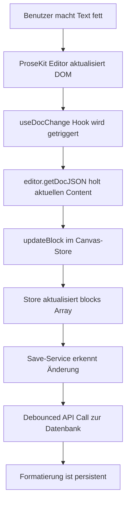

# ProseKit Editor - Problem mit fehlender Speicherung von Formatierungen

## Problem-Analyse

### Symptome

- Formatierungen (fett, kursiv, etc.) werden im Editor angezeigt
- Beim Neuladen der Seite sind die Formatierungen verschwunden
- Änderungen werden nicht in die Datenbank gespeichert

### Root Cause

Die [`TextBlock`](../app/[locale]/builder/components/blocks/TextBlock.tsx)-Komponente hat **keinen `onChange`-Handler** oder **Event-Listener** für Dokumentänderungen.

**Aktueller Code-Fluss:**

1. ✅ Editor wird mit `defaultContent` initialisiert (Zeile 27)
2. ✅ Benutzer macht Text fett → Editor zeigt Formatierung an
3. ❌ **FEHLT**: Editor-Änderungen werden nicht an den Canvas-Store übermittelt
4. ❌ Save-Service hat keine neuen Änderungen zum Speichern
5. ❌ Beim Reload wird nur der alte Content geladen

## Lösungskonzept

### Option 1: `useDocChange` Hook (Empfohlen) ✅

**Best Practice laut ProseKit Dokumentation:**

```typescript
import { useDocChange } from "prosekit/react";

useDocChange(
  () => {
    const json = editor.getDocJSON();
    localStorage.setItem("my-document", JSON.stringify(json));
  },
  { editor }
);
```

**Wichtig:** Die offizielle Dokumentation zeigt `useDocChange` mit:

- ✅ **Direktem Callback** (kein `useCallback` Wrapper)
- ✅ **`{ editor }` als zweiter Parameter** ODER leeres Array `[]`
- ❌ **NICHT** mit `useCallback` wrappen (unnötig, Hook ist bereits optimiert)

**Vorteile:**

- ✅ Offizielle ProseKit API
- ✅ Optimal für React
- ✅ Intern bereits optimiert (kein `useCallback` nötig)
- ✅ Saubere Trennung von UI und State

### Option 2: `defineDocChangeHandler` Extension

Alternative als Editor-Extension:

```typescript
import { defineDocChangeHandler } from "prosekit/core";

const docChangeHandler = defineDocChangeHandler((doc) => {
  // Handle changes
});
```

**Nachteile:**

- ❌ Komplexer zu implementieren
- ❌ Schwieriger auf React-State zuzugreifen
- ❌ Weniger idiomatisch für React

## Implementierungsplan

### Schritt 1: TextBlock mit `useDocChange` erweitern

**Datei:** [`app/[locale]/builder/components/blocks/TextBlock.tsx`](../app/[locale]/builder/components/blocks/TextBlock.tsx)

```typescript
"use client";

import { createEditor } from "prosekit/core";
import { ProseKit, useDocChange } from "prosekit/react";
import { Block } from "@/lib/types/board";
import { cn } from "@/lib/utils";
import { useMemo, useCallback } from "react";
import { EditorToolbar } from "./EditorToolbar";
import { defineExtension } from "./editor-extension";
import { useCanvasStore } from "@/lib/stores/canvas-store";

interface TextBlockProps {
  block: Block;
  isSelected?: boolean;
  isPreviewMode?: boolean;
}

export function TextBlock({
  block,
  isSelected,
  isPreviewMode = false,
}: TextBlockProps) {
  const updateBlock = useCanvasStore((state) => state.updateBlock);

  const extension = useMemo(() => {
    return defineExtension();
  }, []);

  const editor = useMemo(() => {
    return createEditor({
      extension,
      defaultContent: (block.data.content as string) || undefined,
    });
  }, [extension, block.data.content]);

  // 🆕 Listen to document changes and update the store
  // Best Practice: useDocChange akzeptiert Callback direkt, kein useCallback nötig
  useDocChange(
    (doc) => {
      if (!isPreviewMode) {
        const json = editor.getDocJSON();
        updateBlock(block.id, {
          data: {
            ...block.data,
            content: json,
          },
        });
      }
    },
    { editor }
  );

  return (
    <ProseKit editor={editor}>
      <div
        className={cn(
          "w-full h-full min-h-[50px] flex flex-col overflow-hidden",
          !isPreviewMode && "border rounded-md bg-background",
          !isPreviewMode &&
            isSelected &&
            "ring-2 ring-primary ring-offset-2 border-primary"
        )}
      >
        {/* Toolbar nur im Builder-Modus und wenn selektiert */}
        {!isPreviewMode && isSelected && <EditorToolbar blockId={block.id} />}

        <div
          className={cn(
            "prose dark:prose-invert max-w-none flex-1 overflow-y-auto",
            !isPreviewMode && "p-4"
          )}
        >
          <div
            ref={editor.mount}
            className={cn(
              "min-h-[50px] h-full",
              !isPreviewMode && "outline-none"
            )}
            contentEditable={!isPreviewMode}
          />
        </div>
      </div>
    </ProseKit>
  );
}
```

### Wichtige Änderungen:

1. **Import `useDocChange`** (Zeile 3):

   ```typescript
   import { ProseKit, useDocChange } from "prosekit/react";
   ```

2. **Import `useCanvasStore`** (Zeile 10):

   ```typescript
   import { useCanvasStore } from "@/lib/stores/canvas-store";
   ```

3. **Zugriff auf `updateBlock`** (Zeile 19):

   ```typescript
   const updateBlock = useCanvasStore((state) => state.updateBlock);
   ```

4. **`useDocChange` Hook** (Zeilen 108-123):
   - Wird bei **jeder** Dokumentänderung aufgerufen
   - Holt aktuellen Content als JSON: `editor.getDocJSON()`
   - Updated Block im Store: `updateBlock(block.id, { data: { ...block.data, content: json } })`
   - Nur im Builder-Modus (nicht im Preview)
   - **KEIN** `useCallback` nötig (Best Practice)

## Datenfluss nach Implementierung



## Potenzielle Probleme & Lösungen

### Problem 1: Performance (zu viele Updates)

**Symptom:** Editor wird langsam bei schnellem Tippen

**⚠️ Wichtig:** Laut ProseKit Best Practices ist **kein manuelles Debouncing** im `useDocChange` Hook nötig.

**Warum?**

- `useDocChange` wird nur bei **tatsächlichen Dokumentänderungen** getriggert (nicht bei Cursor-Bewegungen)
- Der Save-Service in dieser App hat bereits ein **eingebautes Debouncing** (1 Sekunde)
- Zusätzliches Debouncing kann zu **verlorenen Updates** führen

**Falls Performance-Probleme auftreten:**

```typescript
// Option A: Debouncing im Save-Service anpassen (bereits vorhanden)
// lib/services/save-service.ts
private DEBOUNCE_MS = 1000; // Erhöhen auf 2000 falls nötig

// Option B: Nur bei größeren Änderungen speichern
let lastSavedJson = '';
useDocChange(() => {
    const json = JSON.stringify(editor.getDocJSON());
    if (json !== lastSavedJson) {
        lastSavedJson = json;
        updateBlock(block.id, { data: { ...block.data, content: JSON.parse(json) }});
    }
}, { editor });
```

**Empfehlung:** Zuerst ohne zusätzliches Debouncing implementieren, nur bei nachgewiesenen Performance-Problemen optimieren.

### Problem 2: Infinite Loop durch `defaultContent`

**Symptom:** Editor lädt ständig neu, Stack Overflow

**Root Cause:**

- `useDocChange` updated `block.data.content`
- `useMemo` dependency `block.data.content` ändert sich
- Editor wird neu erstellt
- Loop

**Lösung:** Editor-Creation von `block.data.content` entkoppeln

```typescript
const initialContentRef = useRef(block.data.content);

const editor = useMemo(() => {
  return createEditor({
    extension,
    defaultContent: (initialContentRef.current as string) || undefined,
  });
}, [extension]); // ❌ NICHT block.data.content
```

### Problem 3: Content-Format (JSON vs String)

**Aktuell:** `block.data.content` wird als `string` behandelt (Zeile 27)

**Korrekt:** ProseKit arbeitet mit `NodeJSON` Objekten

**Lösung:** Type-Safe Handling

```typescript
import type { NodeJSON } from "prosekit/core";

interface TextBlockData {
  content?: NodeJSON | string; // Support both for migration
}

// In TextBlock:
const defaultContent = useMemo(() => {
  const content = block.data.content;
  if (!content) return undefined;
  if (typeof content === "string") {
    // Legacy: HTML string → Parse to JSON
    return htmlFromNode(schema, content);
  }
  return content; // Already JSON
}, [block.data.content]);
```

## Testen

### Manueller Test

1. ✅ Text fett machen
2. ✅ Seite neu laden → Formatierung bleibt erhalten
3. ✅ Mehrere Formatierungen kombinieren (fett + kursiv)
4. ✅ Preview-Modus → keine Updates im Store

### Edge Cases

- ✅ Leeres Dokument
- ✅ Schnelles Tippen (Performance)
- ✅ Mehrere TextBlocks gleichzeitig
- ✅ Copy/Paste mit Formatierung

## Best Practice Validierung ✅

Nach Prüfung der offiziellen ProseKit Dokumentation via Context7:

### ✅ Korrekt in unserem Plan:

- `useDocChange` Hook verwenden
- `editor.getDocJSON()` für Content-Extraktion
- `{ editor }` als zweiter Parameter

### ⚠️ Anpassungen basierend auf Best Practices:

- **KEIN** `useCallback` um den `useDocChange` Callback
- **KEIN** zusätzliches Debouncing (Save-Service hat bereits 1s Debounce)
- Direkter Callback ohne Wrapper

### 📋 Referenz-Implementierungen aus ProseKit Docs:

```typescript
// Einfachste Form (offizielle Docs)
useDocChange(
  () => {
    const json = editor.getDocJSON();
    localStorage.setItem("my-document", JSON.stringify(json));
  },
  { editor }
);

// Mit Document-Parameter (für Textanalyse)
useDocChange((doc) => {
  const text = doc.textContent;
  setWordCount(text.trim().split(/\s+/).filter(Boolean).length);
}, []);
```

## Zusammenfassung

**Hauptproblem:** Fehlender `useDocChange` Hook in [`TextBlock.tsx`](../app/[locale]/builder/components/blocks/TextBlock.tsx:27)

**Best Practice Lösung:**

1. `useDocChange` Hook importieren (keine Wrapper!)
2. Bei jeder Änderung `editor.getDocJSON()` aufrufen
3. Content im Canvas-Store updaten
4. Save-Service speichert automatisch mit eingebautem Debouncing

**Geschätzter Aufwand:** 15-30 Minuten (einfacher als ursprünglich gedacht)

**Risiko:** Sehr niedrig (Standard-Pattern aus offizieller Dokumentation)

**Nächste Schritte:** Code-Modus für Implementierung
