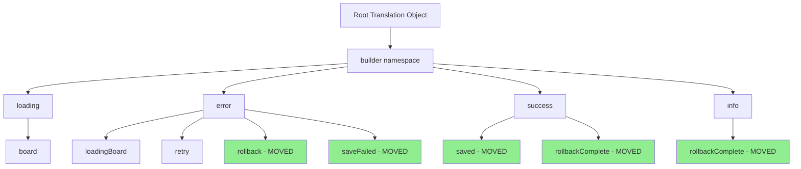

# Translation Structure Fix Plan

## Issue Summary

The application is throwing a console error:

```
MISSING_MESSAGE: Could not resolve `builder.success.saved` in messages for locale `de`.
```

This occurs in [`lib/hooks/use-save-service.ts`](lib/hooks/use-save-service.ts:99) where the code uses:

- `useTranslations("builder")` (line 8)
- But references: `t("success.saved")`, `t("error.saveFailed")`, `t("error.rollback")`, `t("info.rollbackComplete")`

## Root Cause

The translation keys `success`, `error`, and `info` exist at the **root level** of the JSON files (lines 285-295 in both [`messages/en.json`](messages/en.json:285) and [`messages/de.json`](messages/de.json:285)), but the hook is trying to access them under the `builder` namespace (`builder.success.saved`).

## Current Translation Structure

### In both `messages/en.json` and `messages/de.json`:

```json
{
  "builder": {
    "loading": {
      "board": "Loading board..." / "Lade Board..."
    },
    "error": {
      "loadingBoard": "Error loading board" / "Fehler beim Laden des Boards",
      "retry": "Try again" / "Erneut versuchen"
    }
  },
  "success": {  // ❌ This is at ROOT level, not under "builder"
    "saved": "Board saved" / "Board gespeichert",
    "rollbackComplete": "Changes have been reverted" / "Änderungen wurden rückgängig gemacht"
  },
  "info": {
    "rollbackComplete": "Changes have been reverted" / "Änderungen wurden rückgängig gemacht"
  },
  "error": {
    "rollback": "Revert" / "Zurücksetzen",
    "saveFailed": "Save failed" / "Speichern fehlgeschlagen"
  }
}
```

## Solution: Restructure Translations Under `builder` Namespace

Move the `success`, `error`, and `info` objects into the `builder` namespace to match the code's expectation.

### Proposed Structure

```json
{
  "builder": {
    "loading": {
      "board": "Loading board..." / "Lade Board..."
    },
    "error": {
      "loadingBoard": "Error loading board" / "Fehler beim Laden des Boards",
      "retry": "Try again" / "Erneut versuchen",
      "rollback": "Revert" / "Zurücksetzen",
      "saveFailed": "Save failed" / "Speichern fehlgeschlagen"
    },
    "success": {
      "saved": "Board saved" / "Board gespeichert",
      "rollbackComplete": "Changes have been reverted" / "Änderungen wurden rückgängig gemacht"
    },
    "info": {
      "rollbackComplete": "Changes have been reverted" / "Änderungen wurden rückgängig gemacht"
    }
  }
}
```

## Implementation Steps

### 1. Update `messages/en.json`

Move lines 285-295 (the root-level `success`, `info`, `error` objects) **inside** the `builder` object at line 296.

**Before:**

```json
{
  "boardBuilder": { ... },
  "success": { ... },    // lines 285-288
  "info": { ... },       // lines 289-291
  "error": { ... },      // lines 292-295
  "builder": {           // lines 296-304
    "loading": { ... },
    "error": { ... }
  }
}
```

**After:**

```json
{
  "boardBuilder": { ... },
  "builder": {
    "loading": { ... },
    "error": {
      "loadingBoard": "Error loading board",
      "retry": "Try again",
      "rollback": "Revert",
      "saveFailed": "Save failed"
    },
    "success": {
      "saved": "Board saved",
      "rollbackComplete": "Changes have been reverted"
    },
    "info": {
      "rollbackComplete": "Changes have been reverted"
    }
  }
}
```

### 2. Update `messages/de.json`

Apply the same restructuring to the German translation file.

**After:**

```json
{
  "boardBuilder": { ... },
  "builder": {
    "loading": {
      "board": "Lade Board..."
    },
    "error": {
      "loadingBoard": "Fehler beim Laden des Boards",
      "retry": "Erneut versuchen",
      "rollback": "Zurücksetzen",
      "saveFailed": "Speichern fehlgeschlagen"
    },
    "success": {
      "saved": "Board gespeichert",
      "rollbackComplete": "Änderungen wurden rückgängig gemacht"
    },
    "info": {
      "rollbackComplete": "Änderungen wurden rückgängig gemacht"
    }
  }
}
```

## Impact Analysis

### Files Using `useTranslations("builder")`

Based on search results, only the following files use the `builder` namespace:

- [`lib/hooks/use-save-service.ts`](lib/hooks/use-save-service.ts:8) - ✅ The file causing the error
- [`app/[locale]/builder/builder-client.tsx`](app/[locale]/builder/builder-client.tsx:47) - ⚠️ Need to verify usage

### Other Translation Namespaces (No Impact)

These files use different namespaces and won't be affected:

- `hero`, `stats`, `footer`, `cta`, `pricing`, `navbar`, `features`
- `signin`, `signup`, `authError`, `authGuard`, `dropArea`
- `createBoard`, `builderPage`, `boardBuilder`

## Verification Steps

After making the changes:

1. ✅ Verify the error no longer appears in German locale
2. ✅ Test save functionality in both `en` and `de` locales
3. ✅ Test error scenarios to ensure rollback toast messages work
4. ✅ Check [`app/[locale]/builder/builder-client.tsx`](app/[locale]/builder/builder-client.tsx:47) to ensure it doesn't use the moved keys

## Benefits of This Approach

1. **Better Organization**: All builder-related translations are now grouped together
2. **Type Safety**: Matches the code's namespace usage
3. **Maintainability**: Easier to find and manage builder translations
4. **Consistency**: Follows the pattern used in other parts of the application

## Mermaid Diagram: Translation Structure



## Next Steps

Switch to **Code mode** to implement the translation file updates.
